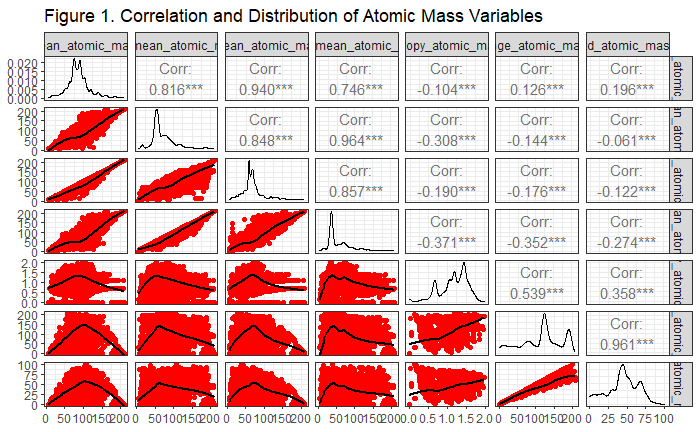
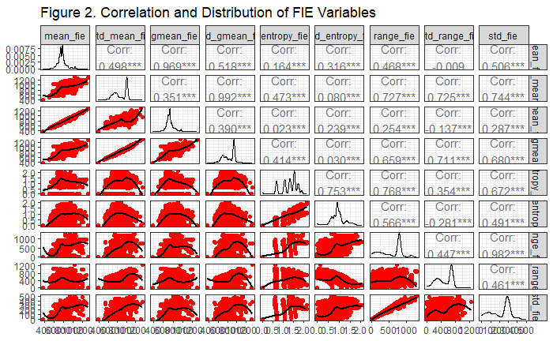
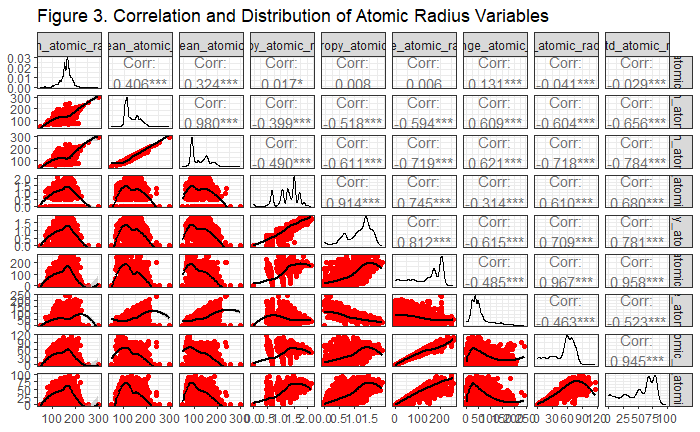
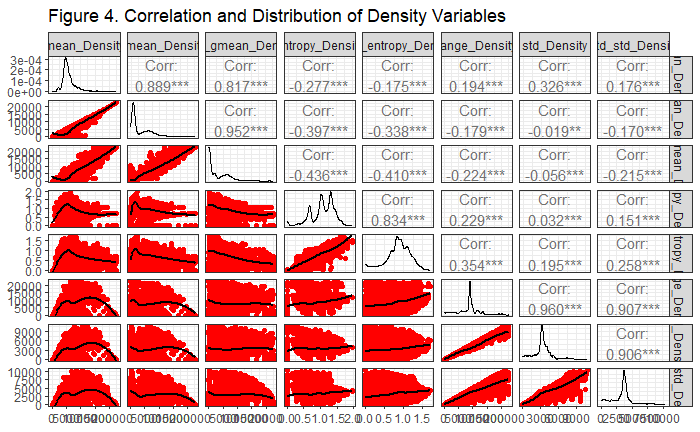
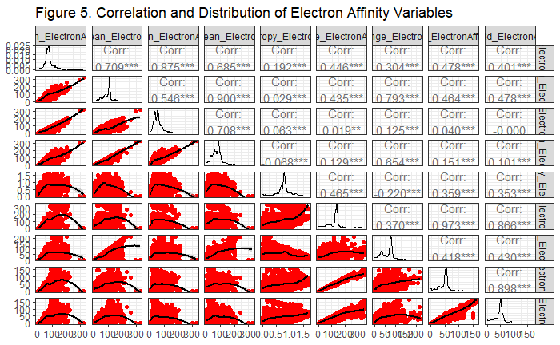
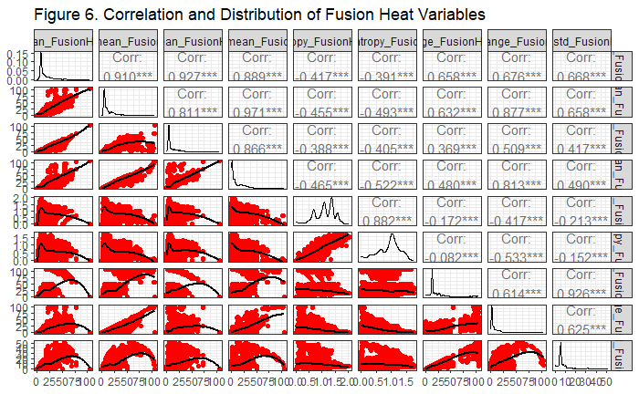
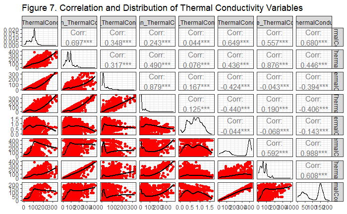
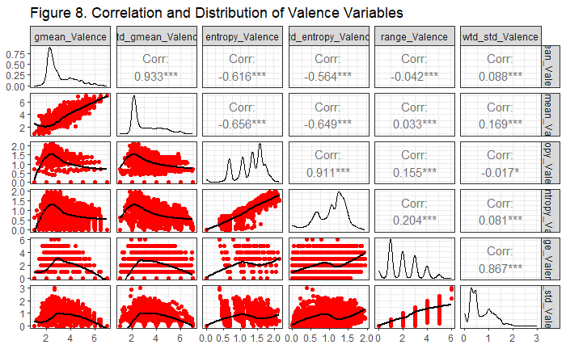

```{r setup, include=FALSE}
knitr::opts_chunk$set(echo = FALSE)
file_path = rstudioapi::getSourceEditorContext()$path
file_location = dirname(file_path)
knitr::opts_knit$set(root.dir = file_location)
```

# 1. INTRODUCTION

## 1.1. MOTIVATION

### 1.1.1. Context

Certain materials exhibit the property of superconductivity, meaning that, under certain conditions, they can carry an electrical current with no losses.
Since the discovery of the first superconductor in 1911 [1], which showed these properties in mercury below a Critical Temperature (Tc) of 4.2 Kelvin (-269 °C), researchers have looked for materials with superconducting properties at higher and higher temperatures.
Applications of superconductors include medical imaging [2] and quantum computing [3], with each becoming significantly cheaper and more scalable as more favourable materials are found.

### 1.1.2. Problem

By modelling data from known materials, this report will attempt to identify parameters of significance leading to higher values of Tc.
This may provide some clues for the properties that researchers should look for in newly proposed materials.
There are some research precedents investigating new materials using statistical methods, with some success [4].
Methods carried out in prior research include linear regression, as well as more complex machine learning techniques like artificial neural networks and gradient-boosting decision trees [5].

### 1.1.3. Challenges

One recent well-known example which speaks to the difficulty of discovering these materials was proposed by researchers [6] at Korea University in July 2023.
This material, a grey-black, polycrystalline compound, identified as a copper-doped lead-oxyapatite and named LK-99 by the team which discovered it, was claimed to exhibit superconducting properties at room temperature and ambient pressure.
While the results were never replicated, the months following LK-99’s publicity saw a flurry of media reporting on the great significance of what this discovery would mean for new technologies [7].

Challenges specific to discovering new materials through linear regression include:

-   **Non-linear relationships**. Superconductivity is governed by complex physical phenomena that often exhibit non-linear relationships. Linear regression assumes a linear relationship between variables, which may not capture these complexities accurately.
-   **High dimensionality**. Superconducting materials are characterized by numerous properties, such as first ionization energy, atomic radius, electron affinity, and fusion heat. This high-dimensional data must be handled carefully to avoid overfitting.
-   **Limited data availability**. Experimental data on superconducting materials is scarce and often noisy. Linear regression models require a large amount of data to produce reliable predictions, and limited data can lead to inaccurate models.

## 1.2. OBJECTIVES

### 1.2.1. Overview

The overall intent of the project is to create a regression model to predict the Critical Temperature (Tc) of different materials.
An accurate regression model to predict Tc can be used to identify which factors lead to a higher Tc.
However, great care must be taken if looking for Tc values above the range of values used in creating our model.

### 1.2.2. Goals & Research Questions

1.  What combination of factors are the most accurate for predicting the Critical Temperature (Tc) of a given material?

2.  Can we use the measured properties of a given material to accurately predict its Critical Temperature (Tc)?

# 2. METHODOLOGY

## 2.1. DATA

The dataset we obtained was sourced from the [GitHub repository](https://github.com/khamidieh/predict_tc?tab=readme-ov-file#predict-the-critical-temperature-of-a-superconductor) of the "A data-driven statistical model for predicting the critical temperature of a superconductor" [8] paper.
The GitHub repository for the paper includes pre-processed data that has been cleaned and is ready for statistical analysis, as well as its own analysis of said data.

We initially planned to start with the same raw data as the author of this paper; however, this 2018 paper cites a now-defunct website as the source for their raw data: <http://supercon.nims.go.jp/supercon/material_menu>.
Attempts were made to find an updated source of the raw data, but we were unable to locate an easily accessible and readable version of the raw data.
Given our limited timeline and the availability of data that had been pre-processed and was ready for statistical analysis, we chose to go ahead with the pre-processed data.

This dataset is licensed under a [Creative Commons Attribution 4.0 International (CC BY 4.0)](https://creativecommons.org/licenses/by/4.0/) license.
This allows for the sharing and adaptation of the dataset for any purpose, provided that the appropriate credit is given.

The dataset we imported and analyzed is a CSV file called `train.csv.` Its 20,000+ rows contain various measurements of various atomic properties of various materials, the number of elements this material contains, and finally, the critical temperature (in Kelvin) that we are trying to create a regression model for.

The dataset can be divided into 8 groups of 10 measurements.
Each group is an atomic property, with 10 different methods used to measure that property.

Atomic Properties (8 total):

-   **Atomic Mass**: the quantity of matter contained in an atom of an element. The observed atomic mass is slightly less than the sum of the mass of the protons, neutrons, and electrons that make up the atom.
-   **First Ionization Energy**: is the energy needed to remove the outermost, or highest energy, electron from a neutral atom in the gas phase.
-   **Atomic Radius**: the average distance from the center of an atom's nucleus to its outermost electron shell.
-   **Density**: a characteristic property of a substance that measures how much mass is in a given volume. It's calculated by dividing the mass of a substance by its volume ($D=m/v$)
-   **Electron Affinity**: a measure of the attraction between the incoming electron and the nucleus - the stronger the attraction, the more energy is released.
-   **Fusion Heat**: the amount of heat energy required to change a solid substance into a liquid at its melting point.
-   **Thermal Conductivity**: the ability of a given material to conduct/transfer heat. It is generally denoted by the symbol $\kappa$ but can also be denoted by $\lambda$ and $\kappa$.
-   **Valence**: A whole number that represents the ability of an atom or a group of atoms to combine with other atoms or groups of atoms.

The dataset contains 21,263 observations and 82 variables, primarily numeric.
Key variables and their descriptions are as follows:

```{r libraries_ggpairsTemplate, echo=FALSE}
library(GGally)
library(ggplot2)
library(mctest)
library(olsrr)
library(lmtest)

plot_ggpairs <- function(data, title=NULL) {
  ggpairs(
    data, title=title,
    lower = list(
      continuous = wrap("smooth", method = "loess", color = "red"),
      combo = "facethist",
      discrete = "facetbar",
      na = "na"
    ),
    upper = list(
      continuous = "cor"
    ),
    diag = list(
      continuous = "densityDiag"
    ),
    progress = FALSE
  ) +
    theme_bw()
}
```

```{r column_names, echo=FALSE}
superconductivity = read.csv("../data/train.csv")
#print(str(superconductivity))
print(colnames(superconductivity))
```

**Explanatory variables:**

-   `number_of_elements`: Number of distinct elements in the material.
-   `mean_atomic_mass`: Average atomic mass of elements.
-   `wtd_mean_atomic_mass`: Weighted average atomic mass, considering each element’s proportion.
-   `gmean_atomic_mass`: Geometric mean of atomic mass across elements.
-   `wtd_gmean_atomic_mass`: Weighted geometric mean of atomic mass.
-   `entropy_atomic_mass`: Entropy (diversity) of atomic mass in the compound.
-   `wtd_entropy_atomic_mass`: Weighted entropy of atomic mass.
-   `range_atomic_mass`: Range of atomic masses in the compound.
-   `wtd_range_atomic_mass`: Weighted range of atomic mass.
-   `std_atomic_mass`: Standard deviation of atomic mass.
-   `wtd_std_atomic_mass`: Weighted standard deviation of atomic mass.
-   `mean_fie`: Mean first ionization energy of elements. Ionization energy affects electron mobility, which is essential for superconductivity.
-   `wtd_mean_fie`: Weighted mean first ionization energy.
-   `gmean_fie`: Geometric mean of first ionization energy. Indicates central ionization tendency, relevant for electron stability.
-   `wtd_gmean_fie`: Weighted geometric mean of ionization energy. Reflects effective ionization tendency based on element proportion, impacting superconductivity.
-   `entropy_fie`: Entropy of ionization energy, showing diversity in electron binding energy.
-   `wtd_entropy_fie`: Weighted entropy of ionization energy. Gives a more precise diversity measure, impacting electron mobility for superconductivity.
-   `range_fie`: Range of ionization energies. Greater range implies variation in electron release energy, influencing Tc.
-   `wtd_range_fie`: Weighted range of ionization energy. Effective diversity measure, impacting electron stability and superconducting behaviour.
-   `std_fie`: Standard deviation of first ionization energy.
-   `wtd_std_fie`: Weighted standard deviation of first ionization energy.
-   `mean_atomic_radius`: Average atomic radius of elements.
-   `wtd_mean_atomic_radius`: Weighted mean atomic radius.
-   `gmean_atomic_radius`: Geometric mean of atomic radius. Indicates central size tendency, relevant to lattice dynamics.
-   `wtd_gmean_atomic_radius`: Weighted geometric mean of atomic radius.
-   `entropy_atomic_radius`: Entropy of atomic radius, showing size diversity.
-   `wtd_entropy_atomic_radius`: Weighted entropy of atomic radius.
-   `range_atomic_radius`: Range of atomic radii in the compound.
-   `wtd_range_atomic_radius`: Weighted range of atomic radius.
-   `std_atomic_radius`: Standard deviation of atomic radius. High variation impacts stability and electron dynamics relevant for superconductivity.
-   `wtd_std_atomic_radius`: Weighted standard deviation of atomic radius.
-   `mean_Density`: Average density of the material.
-   `wtd_mean_Density`: Weighted mean density, adjusted for element proportions.
-   `gmean_Density`: Geometric mean of density.
-   `wtd_gmean_Density`: Weighted geometric mean density.
-   `entropy_Density`: Entropy of density, showing diversity in packing.
-   `wtd_entropy_Density`: Weighted entropy of density.
-   `range_Density`: Range of density values.
-   `wtd_range_Density`: Weighted range of density.
-   `std_Density`: Standard deviation of density.
-   `wtd_std_Density`: Weighted standard deviation of density.
-   `mean_ElectronAffinity`: Average electron affinity of elements.
-   `wtd_mean_ElectronAffinity`: Weighted electron affinity, adjusted for composition.
-   `gmean_ElectronAffinity`: Geometric mean of electron affinity.
-   `wtd_gmean_ElectronAffinity`: Weighted geometric mean electron affinity.
-   `entropy_ElectronAffinity`: Entropy of electron affinity, showing diversity in attraction potential.
-   `wtd_entropy_ElectronAffinity`: Weighted entropy of electron affinity.
-   `range_ElectronAffinity`: Range of electron affinity values.
-   `wtd_range_ElectronAffinity`: Weighted range of electron affinity.
-   `std_ElectronAffinity`: Standard deviation of electron affinity.
-   `wtd_std_ElectronAffinity`: Weighted standard deviation of electron affinity.
-   `mean_FusionHeat`: Average fusion heat of elements.
-   `wtd_mean_FusionHeat`: Weighted fusion heat, adjusted for element composition.
-   `gmean_FusionHeat`: Geometric mean of fusion heat.
-   `wtd_gmean_FusionHeat`: Weighted geometric mean fusion heat.
-   `entropy_FusionHeat`: Entropy of fusion heat, showing melting energy diversity.
-   `wtd_entropy_FusionHeat`: Weighted entropy of fusion heat.
-   `range_FusionHeat`: Range of fusion heat.
-   `wtd_range_FusionHeat`: Weighted range of fusion heat.
-   `std_FusionHeat`: Standard deviation of fusion heat.
-   `wtd_std_FusionHeat`: Weighted standard deviation of fusion heat.
-   `mean_ThermalConductivity`: Average thermal conductivity of the material.
-   `wtd_mean_ThermalConductivity`: Weighted mean thermal conductivity.
-   `gmean_ThermalConductivity`: Geometric mean of thermal conductivity.
-   `wtd_gmean_ThermalConductivity`: Weighted geometric mean of thermal conductivity.
-   `entropy_ThermalConductivity`: Entropy of thermal conductivity, showing diversity in heat transfer.
-   `wtd_entropy_ThermalConductivity`: Weighted entropy of thermal conductivity.
-   `range_ThermalConductivity`: Range of thermal conductivity values.
-   `wtd_range_ThermalConductivity`: Weighted range of thermal conductivity.
-   `std_ThermalConductivity`: Standard deviation of thermal conductivity.
-   `wtd_std_ThermalConductivity`: Weighted standard deviation of thermal conductivity.
-   `mean_Valence`: Average valence electron count.
-   `wtd_mean_Valence`: Weighted average valence electrons.
-   `gmean_Valence`: Geometric mean of valence electrons.
-   `wtd_gmean_Valence`: Weighted geometric mean of valence electrons.
-   `entropy_Valence`: Entropy of valence electron distribution, showing bonding diversity.
-   `wtd_entropy_Valence`: Weighted entropy of valence electrons.
-   `range_Valence`: Range of valence electrons.
-   `std_Valence`: Standard deviation of valence electrons.
-   `wtd_std_Valence`: Weighted standard deviation of valence electrons.

**Derived variable:**

-   `critical_temp`: The Critical Temperature (Tc), the critical temperature below which a given material acts as a superconductor.

## 2.2. Approach

The dataset is already formatted for statistical analysis, as mentioned in the data source; therefore, we can directly begin building a multiple linear regression model.
For the construction of the model, the following approaches will be performed sequentially: addictive model, interactive model and transformation model.
The models will be tested for assumptions wherever necessary.
Previous models [9] without including the interactions have not been successful, so adding the interactions and transformation may help build a better model.
All regression models, calculations, and analyses will be done using R in RStudio.

## 2.3. Workflow

To analyze the critical temperature of superconductors, several factors are considered, including the mean, weighted mean, geometric mean, range, and standard deviation of properties such as atomic mass, valence, atomic radius, electron affinity, density, and thermal conductivity of various elements.

A full additive model was developed with a significance level of 0.01, using the critical temperature as the dependent variable and the other 81 factors as independent variables.
After importing the necessary libraries, a global test was conducted to assess the overall significance of the model.

### 2.3.1. Workflow - Hypotheses

Hypotheses for the global test:

-   **Null Hypothesis** ($H_0$): All $\beta$ coefficients = 0 (The model does not explain variability in the dependent variable).
-   **Alternative Hypothesis** ($H_A$) At least one $\beta$ coefficient $\neq$ 0 (The model significantly explains variability in the dependent variable).

The results of the global test (p-value \< 2.2e-16) indicate that the model is highly significant overall.
This supports further exploration of individual predictors through t-tests to refine the model by removing insignificant variables.

Hypotheses for the t-test:

-   **Null Hypothesis** ($H_0$:) $\beta = 0$ (The coefficient of the independent variable is not significant).
-   **Alternative Hypothesis** ($H_A$): $\beta \neq 0$ (The coefficient of the independent variable is significant).

Following the global test, individual t-tests were performed at each step with an alpha level of 0.01, and insignificant variables were removed.

### 2.3.1 Workflow - Additive Model

The summary of the full additive model is as follows:

```{r temp_model_additive, echo=FALSE}
temp_model_additive = lm(critical_temp~., data=superconductivity)
print(summary(temp_model_additive))
```

```{r temp_model_additive_reduced_1, echo=FALSE}
temp_model_additive_reduced_1 = lm(critical_temp~.-wtd_range_Density, data=superconductivity)
# print(summary(temp_model_additive_reduced_1))
```

```{r temp_model_additive_reduced_2, echo=FALSE}
temp_model_additive_reduced_2 = lm(critical_temp~.-wtd_range_Density-wtd_mean_Density,
                data=superconductivity)
# print(summary(temp_model_additive_reduced_2))
```

```{r temp_model_additive_reduced_3, echo=FALSE}
temp_model_additive_reduced_3 = lm(critical_temp~.-wtd_range_Density-wtd_mean_Density
                -wtd_std_ThermalConductivity, data=superconductivity)
# print(summary(temp_model_additive_reduced_3))
```

```{r temp_model_additive_reduced_4, echo=FALSE}
temp_model_additive_reduced_4 = lm(critical_temp~.-wtd_range_Density
                -wtd_mean_Density-wtd_std_ThermalConductivity
                -wtd_entropy_ThermalConductivity, data=superconductivity)
# print(summary(temp_model_additive_reduced_4))
```

```{r temp_model_additive_reduced_5, echo=FALSE}
temp_model_additive_reduced_5 = lm(critical_temp~.-wtd_range_Density-wtd_mean_Density
                -wtd_std_ThermalConductivity-wtd_entropy_ThermalConductivity
                -gmean_atomic_radius, data=superconductivity)
# print(summary(temp_model_additive_reduced_5))
```

```{r temp_model_additive_reduced_6, echo=FALSE}
temp_model_additive_reduced_6 = lm(critical_temp~.-wtd_range_Density-wtd_mean_Density
                -wtd_std_ThermalConductivity-wtd_entropy_ThermalConductivity
                -gmean_atomic_radius-wtd_entropy_atomic_mass, data=superconductivity)
# print(summary(temp_model_additive_reduced_6))
```

```{r temp_model_additive_reduced_7, echo=FALSE}
temp_model_additive_reduced_7 = lm(critical_temp~.-wtd_range_Density-wtd_mean_Density
                -wtd_std_ThermalConductivity-wtd_entropy_ThermalConductivity
                -gmean_atomic_radius-wtd_entropy_atomic_mass-wtd_range_atomic_mass,
                data=superconductivity)
# print(summary(temp_model_additive_reduced_7))
```

```{r temp_model_additive_reduced_8, echo=FALSE}
temp_model_additive_reduced_8 = lm(critical_temp~.-wtd_range_Density-wtd_mean_Density
                -wtd_std_ThermalConductivity-wtd_entropy_ThermalConductivity
                -gmean_atomic_radius-wtd_entropy_atomic_mass-wtd_range_atomic_mass
                -wtd_range_Valence, data=superconductivity)
# print(summary(temp_model_additive_reduced_8))
```

```{r temp_model_additive_reduced_9, echo=FALSE}
temp_model_additive_reduced_9 = lm(critical_temp~.-wtd_range_Density-wtd_mean_Density
                -wtd_std_ThermalConductivity-wtd_entropy_ThermalConductivity
                -gmean_atomic_radius-wtd_entropy_atomic_mass-wtd_range_atomic_mass
                -wtd_range_Valence-wtd_std_fie, data=superconductivity)
# print(summary(temp_model_additive_reduced_9))
```

```{r temp_model_additive_reduced_10, echo=FALSE}
temp_model_additive_reduced_10 = lm(critical_temp~.-wtd_range_Density-wtd_mean_Density
                -wtd_std_ThermalConductivity-wtd_entropy_ThermalConductivity
                -gmean_atomic_radius-wtd_entropy_atomic_mass
                -wtd_range_atomic_mass-wtd_range_Valence
                -wtd_std_fie-wtd_std_atomic_mass, data=superconductivity)
# print(summary(temp_model_additive_reduced_10))
```

```{r temp_model_additive_reduced_11, echo=FALSE}
temp_model_additive_reduced_11 = lm(critical_temp~.-wtd_range_Density-wtd_mean_Density
                -wtd_std_ThermalConductivity-wtd_entropy_ThermalConductivity
                -gmean_atomic_radius-wtd_entropy_atomic_mass-wtd_range_atomic_mass
                -wtd_range_Valence-wtd_std_fie-wtd_std_atomic_mass
                -entropy_ElectronAffinity, data=superconductivity)
# print(summary(temp_model_additive_reduced_11))
```

```{r temp_model_additive_reduced_12, echo=FALSE}
temp_model_additive_reduced_12 = lm(critical_temp~.-wtd_range_Density-wtd_mean_Density
                -wtd_std_ThermalConductivity-wtd_entropy_ThermalConductivity
                -gmean_atomic_radius-wtd_entropy_atomic_mass-wtd_range_atomic_mass
                -wtd_range_Valence-wtd_std_fie-wtd_std_atomic_mass
                -entropy_ElectronAffinity-std_FusionHeat, data=superconductivity)
# print(summary(temp_model_additive_reduced_12))
```

```{r temp_model_additive_reduced_13, echo=FALSE}
temp_model_additive_reduced_13 = lm(critical_temp~.-wtd_range_Density-wtd_mean_Density
                -wtd_std_ThermalConductivity-wtd_entropy_ThermalConductivity
                -gmean_atomic_radius-wtd_entropy_atomic_mass-wtd_range_atomic_mass
                -wtd_range_Valence-wtd_std_fie-wtd_std_atomic_mass
                -entropy_ElectronAffinity-std_FusionHeat-mean_Valence, 
                data=superconductivity)
# print(summary(temp_model_additive_reduced_13))
```

```{r temp_model_additive_reduced_14, echo=FALSE}
temp_model_additive_reduced_14 = lm(critical_temp~.-wtd_range_Density-wtd_mean_Density
                -wtd_std_ThermalConductivity-wtd_entropy_ThermalConductivity
                -gmean_atomic_radius-wtd_entropy_atomic_mass-wtd_range_atomic_mass
                -wtd_range_Valence-wtd_std_fie-wtd_std_atomic_mass
                -entropy_ElectronAffinity-std_FusionHeat-mean_Valence
                -std_Valence, data=superconductivity)
# print(summary(temp_model_additive_reduced_14))
```

The following is the model including all significant variables:

```{r temp_model_additive_reduced_15, echo=FALSE}
temp_model_additive_reduced_15 = lm(critical_temp~.-wtd_range_Density-wtd_mean_Density
                -wtd_std_ThermalConductivity-wtd_entropy_ThermalConductivity
                -gmean_atomic_radius-wtd_entropy_atomic_mass-wtd_range_atomic_mass
                -wtd_range_Valence-wtd_std_fie-wtd_std_atomic_mass-entropy_ElectronAffinity
                -std_FusionHeat-mean_Valence-std_Valence-wtd_mean_Valence,
                data=superconductivity)
print(summary(temp_model_additive_reduced_15))
```

### 2.3.2 Workflow - Multicollinearity (using ggpairs)

The test of multicollinearity states that independent variables that are correlated with each other provide redundant information.
When independent variables are linearly correlated, multicollinearity is said to exist.

The Variance Inflation Factor (VIF) identifies which variables are affected by multicollinearity and the strength of the correlation.
A VIF index of 1 indicates that multicollinearity exists among the predictor variables.
A `ggplot` function was created to visualize the correlation between the predictor variables, as shown below:

```{r show_ggpairs, echo=FALSE}
##### Workflow - Multicollinearity - GGPAIRS
# WARNING: GGPAIR so long compute time
show_gg_pairs = TRUE
```


```{r ggpairs_atomic_mass, echo=FALSE}
# WARNING: GGPAIR so long compute time
atomic_mass = superconductivity[, c("mean_atomic_mass", "wtd_mean_atomic_mass",
                                    "gmean_atomic_mass", "wtd_gmean_atomic_mass",
                                    "entropy_atomic_mass", "range_atomic_mass",
                                    "std_atomic_mass")]
fig1_file = "../data/Figure_1_ggpair_atomic_mass.png"
if(file.exists(fig1_file) == FALSE){print(
  plot_ggpairs(atomic_mass, title = "Figure 1. Correlation and Distribution of Atomic Mass Variables")
)}
```



```{r ggpairs_superconductivity, echo=FALSE}
# WARNING: GGPAIR so long compute time
fie = superconductivity[, c("mean_fie", "wtd_mean_fie", "gmean_fie", "wtd_gmean_fie",
                            "entropy_fie", "wtd_entropy_fie", "range_fie",
                            "wtd_range_fie", "std_fie")]
fig2_file = "../data/Figure_2_ggpair_fie.png"
if(file.exists(fig2_file) == FALSE){print(
  plot_ggpairs(fie, title = "Figure 2. Correlation and Distribution of FIE Variables")
)}
```



```{r ggpairs_atomic_radius, echo=FALSE}
# WARNING: GGPAIR so long compute time
atomic_radius = superconductivity[, c("mean_atomic_radius", "wtd_mean_atomic_radius",
                                      "wtd_gmean_atomic_radius", "entropy_atomic_radius",
                                      "wtd_entropy_atomic_radius", "range_atomic_radius",
                                      "wtd_range_atomic_radius", "std_atomic_radius",
                                      "wtd_std_atomic_radius" )]
fig3_file = "../data/Figure_3_ggpair_atomic_radius.png"
if(file.exists(fig3_file) == FALSE){print(
  plot_ggpairs(atomic_radius, title = "Figure 3. Correlation and Distribution of Atomic Radius Variables")
)}
```



```{r ggpairs_density, echo=FALSE}
# WARNING: GGPAIR so long compute time
density = superconductivity[, c("mean_Density", "gmean_Density", "wtd_gmean_Density",
                                "entropy_Density", "wtd_entropy_Density",
                                "range_Density", "std_Density", "wtd_std_Density")]
fig4_file = "../data/Figure_4_ggpair_density.png"
if(file.exists(fig4_file) == FALSE){print(
  plot_ggpairs(density, title = "Figure 4. Correlation and Distribution of Density Variables")
)}
```



```{r ggpairs_ElectronAffinity, echo=FALSE}
# WARNING: GGPAIR so long compute time
ElectronAffinity = superconductivity[, c("mean_ElectronAffinity", "wtd_mean_ElectronAffinity",
                                         "gmean_ElectronAffinity", "wtd_gmean_ElectronAffinity",
                                         "wtd_entropy_ElectronAffinity", "range_ElectronAffinity",
                                         "wtd_range_ElectronAffinity", "std_ElectronAffinity",
                                         "wtd_std_ElectronAffinity")]
fig5_file = "../data/Figure_5_ggpair_ElectronAffinity.png"
if(file.exists(fig5_file) == FALSE){print(
  plot_ggpairs(ElectronAffinity, title = "Figure 5. Correlation and Distribution of Electron Affinity Variables")
)}
```



```{r ggpairs_FusionHeat, echo=FALSE}
# WARNING: GGPAIR so long compute time
FusionHeat = superconductivity[, c("mean_FusionHeat", "wtd_mean_FusionHeat",
                                   "gmean_FusionHeat", "wtd_gmean_FusionHeat",
                                   "entropy_FusionHeat", "wtd_entropy_FusionHeat",
                                   "range_FusionHeat", "wtd_range_FusionHeat",
                                   "wtd_std_FusionHeat")]
fig6_file = "../data/Figure_6_ggpair_FusionHeat.png"
if(file.exists(fig6_file) == FALSE){print(
  plot_ggpairs(FusionHeat, title = "Figure 6. Correlation and Distribution of Fusion Heat Variables")
)}
```



```{r ggpairs_ThermalConductivity, echo=FALSE}
# WARNING: GGPAIR so long compute time
ThermalConductivity = superconductivity[, c("mean_ThermalConductivity",
                                            "wtd_mean_ThermalConductivity",
                                            "gmean_ThermalConductivity",
                                            "wtd_gmean_ThermalConductivity",
                                            "entropy_ThermalConductivity",
                                            "range_ThermalConductivity",
                                            "wtd_range_ThermalConductivity",
                                            "std_ThermalConductivity")]
fig7_file = "../data/Figure_7_ggpair_ThermalConductivity.png"
if(file.exists(fig7_file) == FALSE){print(
  plot_ggpairs(ThermalConductivity, title = "Figure 7. Correlation and Distribution of Thermal Conductivity Variables")
)}
```



```{r ggpairs_Valence, echo=FALSE}
# WARNING: GGPAIR so long compute time
Valence = superconductivity[, c("gmean_Valence", "wtd_gmean_Valence", "entropy_Valence",
                                "wtd_entropy_Valence", "range_Valence", "wtd_std_Valence")]
fig8_file = "../data/Figure_8_ggpair_Valence.png"
if(file.exists(fig8_file) == FALSE){print(
  plot_ggpairs(Valence, title = "Figure 8. Correlation and Distribution of Valence Variables")
)}
```




```{r ending_chunk}
print("temp end")
```

Predictor variables with a high correlation (greater than 0.9) were considered redundant, and only one variable was retained to avoid redundancy in the model.

```{r temp_model_additive_reduced_16, echo=FALSE}
temp_model_additive_reduced_16 = lm(critical_temp~number_of_elements+mean_atomic_mass
                         +wtd_mean_atomic_mass+entropy_atomic_mass+range_atomic_mass
                         +mean_fie+wtd_mean_fie+entropy_fie+wtd_entropy_fie
                         +range_fie+wtd_range_fie+mean_atomic_radius
                         +wtd_mean_atomic_radius+entropy_atomic_radius
                         +range_atomic_radius+wtd_range_atomic_radius+mean_Density
                         +gmean_Density+entropy_Density+wtd_entropy_Density
                         +range_Density+mean_ElectronAffinity+wtd_mean_ElectronAffinity
                         +gmean_ElectronAffinity+wtd_entropy_ElectronAffinity
                         +range_ElectronAffinity+wtd_range_ElectronAffinity
                         +wtd_std_ElectronAffinity+mean_FusionHeat+wtd_gmean_FusionHeat
                         +entropy_FusionHeat+wtd_entropy_FusionHeat+range_FusionHeat
                         +wtd_range_FusionHeat+mean_ThermalConductivity
                         +wtd_mean_ThermalConductivity+gmean_ThermalConductivity
                         +wtd_gmean_ThermalConductivity+entropy_ThermalConductivity
                         +range_ThermalConductivity+wtd_range_ThermalConductivity
                         +gmean_Valence+entropy_Valence+range_Valence+wtd_std_Valence,
                         data=superconductivity)
# print(summary(temp_model_additive_reduced_16))
```

### 2.3.3 Workflow - Reduced Model

A reduced model was developed by removing insignificant variables whose p-values were greater than the alpha level (0.01).
The hypothesis test was based on the following:

-   **Null Hypothesis** $H_0: \beta = 0$ (The coefficient of the independent variable is not significant).
-   **Alternative Hypothesis** $H_A: \beta \neq 0$ (The coefficient of the independent variable is significant).

```{r temp_model_additive_reduced_17, echo=FALSE}
temp_model_additive_reduced_17 = lm(critical_temp~number_of_elements+mean_atomic_mass
                         +wtd_mean_atomic_mass+entropy_atomic_mass+range_atomic_mass
                         +mean_fie+wtd_mean_fie+entropy_fie+wtd_entropy_fie+range_fie
                         +wtd_range_fie+mean_atomic_radius+wtd_mean_atomic_radius
                         +entropy_atomic_radius+range_atomic_radius+wtd_range_atomic_radius
                         +mean_Density+gmean_Density+entropy_Density+wtd_entropy_Density
                         +range_Density+mean_ElectronAffinity+wtd_mean_ElectronAffinity
                         +gmean_ElectronAffinity+wtd_entropy_ElectronAffinity
                         +range_ElectronAffinity+wtd_range_ElectronAffinity
                         +wtd_std_ElectronAffinity+wtd_gmean_FusionHeat+entropy_FusionHeat
                         +wtd_entropy_FusionHeat+range_FusionHeat+wtd_range_FusionHeat
                         +mean_ThermalConductivity+wtd_mean_ThermalConductivity
                         +gmean_ThermalConductivity+wtd_gmean_ThermalConductivity
                         +entropy_ThermalConductivity+range_ThermalConductivity
                         +wtd_range_ThermalConductivity+gmean_Valence+entropy_Valence
                         +range_Valence+wtd_std_Valence, data=superconductivity)
# print(summary(temp_model_additive_reduced_17))
```

```{r temp_model_additive_reduced_18, echo=FALSE}
temp_model_additive_reduced_18 = lm(critical_temp~number_of_elements+mean_atomic_mass
                         +wtd_mean_atomic_mass+entropy_atomic_mass+range_atomic_mass
                         +mean_fie+wtd_mean_fie+entropy_fie+wtd_entropy_fie+range_fie
                         +wtd_range_fie+mean_atomic_radius+wtd_mean_atomic_radius
                         +entropy_atomic_radius+range_atomic_radius+wtd_range_atomic_radius
                         +mean_Density+gmean_Density+entropy_Density+wtd_entropy_Density
                         +range_Density+mean_ElectronAffinity+wtd_mean_ElectronAffinity
                         +gmean_ElectronAffinity+wtd_entropy_ElectronAffinity
                         +range_ElectronAffinity+wtd_range_ElectronAffinity
                         +wtd_std_ElectronAffinity+wtd_gmean_FusionHeat+entropy_FusionHeat
                         +wtd_entropy_FusionHeat+range_FusionHeat+wtd_range_FusionHeat
                         +mean_ThermalConductivity+wtd_mean_ThermalConductivity
                         +gmean_ThermalConductivity+wtd_gmean_ThermalConductivity
                         +entropy_ThermalConductivity+wtd_range_ThermalConductivity
                         +gmean_Valence+ entropy_Valence+range_Valence+wtd_std_Valence,
                         data=superconductivity)
# print(summary(temp_model_additive_reduced_18))
```

```{r temp_model_additive_reduced_19, echo=FALSE}
temp_model_additive_reduced_19 = lm(critical_temp~number_of_elements+mean_atomic_mass
                         +wtd_mean_atomic_mass+entropy_atomic_mass+range_atomic_mass
                         +mean_fie+wtd_mean_fie+entropy_fie+wtd_entropy_fie+range_fie
                         +wtd_range_fie+mean_atomic_radius+wtd_mean_atomic_radius
                         +entropy_atomic_radius+range_atomic_radius+wtd_range_atomic_radius
                         +mean_Density+gmean_Density+entropy_Density+wtd_entropy_Density
                         +range_Density+mean_ElectronAffinity+wtd_mean_ElectronAffinity
                         +gmean_ElectronAffinity+wtd_entropy_ElectronAffinity
                         +range_ElectronAffinity+wtd_range_ElectronAffinity
                         +wtd_std_ElectronAffinity+wtd_gmean_FusionHeat+entropy_FusionHeat
                         +wtd_entropy_FusionHeat+range_FusionHeat+wtd_range_FusionHeat
                         +mean_ThermalConductivity+wtd_mean_ThermalConductivity
                         +gmean_ThermalConductivity+wtd_gmean_ThermalConductivity
                         +entropy_ThermalConductivity+wtd_range_ThermalConductivity
                         +gmean_Valence+range_Valence+wtd_std_Valence, data=superconductivity)
#print(summary(temp_model_additive_reduced_19))
```

```{r temp_model_additive_reduced_20, echo=FALSE}
temp_model_additive_reduced_20 = lm(critical_temp~number_of_elements+mean_atomic_mass
                         +wtd_mean_atomic_mass+entropy_atomic_mass+range_atomic_mass
                         +mean_fie+wtd_mean_fie+entropy_fie+wtd_entropy_fie+range_fie
                         +wtd_range_fie+mean_atomic_radius+wtd_mean_atomic_radius
                         +entropy_atomic_radius+range_atomic_radius+wtd_range_atomic_radius
                         +mean_Density+gmean_Density+entropy_Density+wtd_entropy_Density
                         +mean_ElectronAffinity+wtd_mean_ElectronAffinity+gmean_ElectronAffinity
                         +wtd_entropy_ElectronAffinity+range_ElectronAffinity
                         +wtd_range_ElectronAffinity+wtd_std_ElectronAffinity
                         +wtd_gmean_FusionHeat+entropy_FusionHeat+wtd_entropy_FusionHeat
                         +range_FusionHeat+wtd_range_FusionHeat+mean_ThermalConductivity
                         +wtd_mean_ThermalConductivity+gmean_ThermalConductivity
                         +wtd_gmean_ThermalConductivity+entropy_ThermalConductivity
                         +wtd_range_ThermalConductivity+gmean_Valence+range_Valence
                         +wtd_std_Valence, data=superconductivity)
# print(summary(temp_model_additive_reduced_20))
```

```{r temp_model_additive_reduced_21, echo=FALSE}
temp_model_additive_reduced_21 = lm(critical_temp~number_of_elements+mean_atomic_mass+wtd_mean_atomic_mass
                         +entropy_atomic_mass+range_atomic_mass+mean_fie+wtd_mean_fie
                         +entropy_fie+wtd_entropy_fie+range_fie+wtd_range_fie+mean_atomic_radius
                         +wtd_mean_atomic_radius+entropy_atomic_radius+range_atomic_radius
                         +wtd_range_atomic_radius+mean_Density+gmean_Density+entropy_Density
                         +wtd_entropy_Density+mean_ElectronAffinity+wtd_mean_ElectronAffinity
                         +gmean_ElectronAffinity+wtd_entropy_ElectronAffinity+range_ElectronAffinity
                         +wtd_range_ElectronAffinity+wtd_std_ElectronAffinity+wtd_gmean_FusionHeat
                         +entropy_FusionHeat+wtd_entropy_FusionHeat+range_FusionHeat
                         +wtd_range_FusionHeat+mean_ThermalConductivity+wtd_mean_ThermalConductivity
                         +wtd_gmean_ThermalConductivity+entropy_ThermalConductivity
                         +wtd_range_ThermalConductivity+gmean_Valence+range_Valence+wtd_std_Valence,
                         data=superconductivity)
# print(summary(temp_model_additive_reduced_21))
```

```{r temp_model_additive_reduced_22, echo=FALSE}
temp_model_additive_reduced_22 = lm(critical_temp~number_of_elements+mean_atomic_mass+wtd_mean_atomic_mass
                         +entropy_atomic_mass+range_atomic_mass+wtd_mean_fie+entropy_fie
                         +wtd_entropy_fie+range_fie+wtd_range_fie+mean_atomic_radius
                         +wtd_mean_atomic_radius+entropy_atomic_radius+range_atomic_radius
                         +wtd_range_atomic_radius+mean_Density+gmean_Density+entropy_Density
                         +wtd_entropy_Density+mean_ElectronAffinity+wtd_mean_ElectronAffinity
                         +gmean_ElectronAffinity+wtd_entropy_ElectronAffinity+range_ElectronAffinity
                         +wtd_range_ElectronAffinity+wtd_std_ElectronAffinity+wtd_gmean_FusionHeat
                         +entropy_FusionHeat+wtd_entropy_FusionHeat+range_FusionHeat
                         +wtd_range_FusionHeat+mean_ThermalConductivity+wtd_mean_ThermalConductivity
                         +wtd_gmean_ThermalConductivity+entropy_ThermalConductivity
                         +wtd_range_ThermalConductivity+gmean_Valence+range_Valence+wtd_std_Valence,
                         data=superconductivity)
# print(summary(temp_model_additive_reduced_22))
```

```{r temp_model_additive_reduced_23, echo=FALSE}
temp_model_additive_reduced_23 = lm(critical_temp~number_of_elements+mean_atomic_mass+wtd_mean_atomic_mass
                         +entropy_atomic_mass+range_atomic_mass+wtd_mean_fie+entropy_fie
                         +wtd_entropy_fie+wtd_range_fie+mean_atomic_radius+wtd_mean_atomic_radius
                         +entropy_atomic_radius+range_atomic_radius+wtd_range_atomic_radius
                         +mean_Density+gmean_Density+entropy_Density+wtd_entropy_Density
                         +mean_ElectronAffinity+wtd_mean_ElectronAffinity+gmean_ElectronAffinity
                         +wtd_entropy_ElectronAffinity+range_ElectronAffinity+wtd_range_ElectronAffinity
                         +wtd_std_ElectronAffinity+wtd_gmean_FusionHeat+entropy_FusionHeat
                         +wtd_entropy_FusionHeat+range_FusionHeat+wtd_range_FusionHeat
                         +mean_ThermalConductivity+wtd_mean_ThermalConductivity
                         +wtd_gmean_ThermalConductivity+entropy_ThermalConductivity
                         +wtd_range_ThermalConductivity+gmean_Valence+range_Valence+wtd_std_Valence,
                         data=superconductivity)
# print(summary(temp_model_additive_reduced_23))
```

```{r temp_model_additive_reduced_24, echo=FALSE}
temp_model_additive_reduced_24 = lm(critical_temp~number_of_elements+mean_atomic_mass+wtd_mean_atomic_mass
                         +entropy_atomic_mass+range_atomic_mass+wtd_mean_fie+entropy_fie
                         +wtd_entropy_fie+range_fie+wtd_range_fie+mean_atomic_radius
                         +wtd_mean_atomic_radius+entropy_atomic_radius+range_atomic_radius
                         +wtd_range_atomic_radius+mean_Density+gmean_Density+entropy_Density
                         +wtd_entropy_Density+mean_ElectronAffinity+wtd_mean_ElectronAffinity
                         +gmean_ElectronAffinity+wtd_entropy_ElectronAffinity+range_ElectronAffinity
                         +wtd_range_ElectronAffinity+wtd_gmean_FusionHeat+entropy_FusionHeat
                         +wtd_entropy_FusionHeat+range_FusionHeat+wtd_range_FusionHeat
                         +mean_ThermalConductivity+wtd_mean_ThermalConductivity
                         +wtd_gmean_ThermalConductivity+entropy_ThermalConductivity
                         +wtd_range_ThermalConductivity+gmean_Valence+range_Valence
                         +wtd_std_Valence, data=superconductivity)
# print(summary(temp_model_additive_reduced_24))
```

```{r temp_model_additive_reduced_25, echo=FALSE}
temp_model_additive_reduced_25 = lm(critical_temp~number_of_elements+mean_atomic_mass+wtd_mean_atomic_mass
                         +entropy_atomic_mass+range_atomic_mass+wtd_mean_fie+entropy_fie
                         +wtd_entropy_fie+wtd_range_fie+mean_atomic_radius+wtd_mean_atomic_radius
                         +entropy_atomic_radius+range_atomic_radius+wtd_range_atomic_radius
                         +mean_Density+gmean_Density+entropy_Density+wtd_entropy_Density
                         +mean_ElectronAffinity+wtd_mean_ElectronAffinity+gmean_ElectronAffinity
                         +wtd_entropy_ElectronAffinity+range_ElectronAffinity+wtd_range_ElectronAffinity
                         +wtd_gmean_FusionHeat+entropy_FusionHeat+wtd_entropy_FusionHeat+range_FusionHeat
                         +wtd_range_FusionHeat+mean_ThermalConductivity+wtd_mean_ThermalConductivity
                         +wtd_gmean_ThermalConductivity+entropy_ThermalConductivity
                         +wtd_range_ThermalConductivity+gmean_Valence+range_Valence+wtd_std_Valence,
                         data=superconductivity)
# print(summary(temp_model_additive_reduced_25))
```

```{r temp_model_additive_reduced_26, echo=FALSE}
temp_model_additive_reduced_26 = lm(critical_temp~number_of_elements+mean_atomic_mass+wtd_mean_atomic_mass
                          +entropy_atomic_mass+range_atomic_mass+wtd_mean_fie+entropy_fie
                          +wtd_entropy_fie+wtd_range_fie+mean_atomic_radius+wtd_mean_atomic_radius
                          +entropy_atomic_radius+range_atomic_radius+wtd_range_atomic_radius
                          +mean_Density+gmean_Density+entropy_Density+wtd_entropy_Density
                          +mean_ElectronAffinity+wtd_mean_ElectronAffinity+gmean_ElectronAffinity
                          +wtd_entropy_ElectronAffinity+range_ElectronAffinity+wtd_range_ElectronAffinity
                          +wtd_gmean_FusionHeat+entropy_FusionHeat+wtd_entropy_FusionHeat
                          +range_FusionHeat+wtd_range_FusionHeat+mean_ThermalConductivity
                          +wtd_mean_ThermalConductivity+wtd_gmean_ThermalConductivity
                          +entropy_ThermalConductivity+wtd_range_ThermalConductivity
                          +range_Valence+wtd_std_Valence, data=superconductivity)
# print(summary(temp_model_additive_reduced_26))
```

```{r imcdiag_temp_model_additive_reduced_26, echo=FALSE}
# print(imcdiag(temp_model_additive_reduced_26, method="VIF"))
```

```{r show_reduced_ggpairs, echo=FALSE}
#### Workflow - Reduced Model - REDUCED_GGPAIRS
##### REDUCED_GGPAIRS are commented out
# # WARNING: GGPAIR so long compute time
show_reduced_ggpairs = FALSE
```

```{r reduced_data_part_1, echo=FALSE}
# WARNING: GGPAIR so long compute time
reduced_data_part_1 = superconductivity[, c("number_of_elements", "mean_atomic_mass",
                                            "wtd_mean_atomic_mass", "entropy_atomic_mass",
                                            "wtd_mean_fie", "entropy_fie",
                                            "wtd_entropy_fie", "wtd_range_fie")]

# if(show_reduced_ggpairs == TRUE){print(plot_ggpairs(reduced_data_part_1))}
```

```{r reduced_data_part_2, echo=FALSE}
# WARNING: GGPAIR so long compute time
reduced_data_part_2 = superconductivity[, c("wtd_mean_atomic_radius", "entropy_atomic_radius",
                                            "range_atomic_radius", "mean_Density",
                                            "gmean_Density", "entropy_Density",
                                            "wtd_entropy_Density")]

# if(show_reduced_ggpairs == TRUE){print(plot_ggpairs(reduced_data_part_2))}
```

```{r reduced_data_part_3, echo=FALSE}
# WARNING: GGPAIR so long compute time
reduced_data_part_3 = superconductivity[, c("mean_ElectronAffinity", "wtd_mean_ElectronAffinity",
                                            "gmean_ElectronAffinity", "wtd_entropy_ElectronAffinity",
                                            "wtd_range_ElectronAffinity", "entropy_FusionHeat",
                                            "wtd_entropy_FusionHeat", "wtd_mean_ThermalConductivity",
                                            "wtd_range_ThermalConductivity")]

# if(show_reduced_ggpairs == TRUE){print(plot_ggpairs(reduced_data_part_3))}
```

```{r temp_model_additive_reduced_27, echo=FALSE}
temp_model_additive_reduced_27 = lm(critical_temp ~ number_of_elements+mean_atomic_mass+wtd_mean_atomic_mass
             +wtd_mean_fie+wtd_entropy_fie+wtd_range_fie+wtd_mean_atomic_radius
             +entropy_atomic_radius+range_atomic_radius+mean_Density+wtd_entropy_Density
             +mean_ElectronAffinity+wtd_mean_ElectronAffinity+wtd_entropy_ElectronAffinity
             +wtd_range_ElectronAffinity+entropy_FusionHeat+wtd_mean_ThermalConductivity,
             data=superconductivity)
# print(summary(temp_model_additive_reduced_27))
```

```{r imcdiag_temp_model_additive_reduced_27, echo=FALSE}
# print(imcdiag(temp_model_additive_reduced_27, method="VIF"))
```

```{r reduced_data_part_4, echo=FALSE}
# WARNING: GGPAIR so long compute time
reduced_data_part_4 = superconductivity[, c("number_of_elements", "wtd_mean_fie",
                                            "wtd_entropy_fie", "wtd_range_fie",
                                            "entropy_atomic_radius", "wtd_mean_ElectronAffinity",
                                            "wtd_range_ElectronAffinity", "entropy_FusionHeat")]

# if(show_reduced_ggpairs == TRUE){print(plot_ggpairs(reduced_data_part_4))}
```

```{r temp_model_additive_reduced_28, echo=FALSE}
temp_model_additive_reduced_28 = lm(critical_temp ~ number_of_elements+mean_atomic_mass+wtd_mean_atomic_mass
             +wtd_mean_fie+wtd_entropy_fie+wtd_range_fie+wtd_mean_atomic_radius
             +range_atomic_radius+mean_Density+wtd_entropy_Density+mean_ElectronAffinity
             +wtd_mean_ElectronAffinity+wtd_entropy_ElectronAffinity+wtd_mean_ThermalConductivity,
             data=superconductivity)
# print(summary(temp_model_additive_reduced_28))
```

The following model includes only significant variables and is free from multicollinearity:

```{r final_model_additive, echo=FALSE}
final_model_additive = lm(critical_temp ~ number_of_elements+mean_atomic_mass+wtd_mean_atomic_mass
             +wtd_mean_fie+wtd_entropy_fie+wtd_mean_atomic_radius+range_atomic_radius
             +mean_Density+wtd_entropy_Density+mean_ElectronAffinity+wtd_mean_ElectronAffinity
             +wtd_entropy_ElectronAffinity+wtd_mean_ThermalConductivity, data=superconductivity)
print(summary(final_model_additive))
```

```{r imcdiag_final_model_additive, echo=FALSE}
print(imcdiag(final_model_additive, method="VIF"))
```

### 2.3.4 Workflow - Interactions & Individual T-Test

Interaction terms were added to the final additive model, and a forward selection approach was applied with a significance level of 0.01 to remove insignificant interactions.

The summary of the full interaction model is as follows:

```{r temp_model_int, echo=FALSE}
temp_model_int = lm(critical_temp ~ (number_of_elements+mean_atomic_mass+wtd_mean_atomic_mass
                                  +wtd_mean_fie+wtd_entropy_fie+wtd_mean_atomic_radius
                                  +range_atomic_radius+mean_Density+wtd_entropy_Density
                                  +mean_ElectronAffinity+wtd_mean_ElectronAffinity
                                  +wtd_entropy_ElectronAffinity+wtd_mean_ThermalConductivity)^2,
                 data=superconductivity)
print(summary(temp_model_int))
```

An individual t-test was subsequently performed, as the forward selection approach failed to eliminate some insignificant terms from the model.
The t-test was based on the following hypotheses:

-   **Null Hypothesis** ($H_0$:) $\beta = 0$ (The coefficient of the independent variable is not significant).
-   **Alternative Hypothesis** ($H_A$): $\beta \neq 0$ (The coefficient of the independent variable is significant).

```{r temp_model_int_reduced_1, echo=FALSE}
#### Workflow - Individual T-Test - FIRST STEPWISE
# WARNING: STEPWISE so long compute time

### Original:
# temp_model_int_reduced_1 = ols_step_forward_p(temp_model_int, p_val=0.01, details=FALSE)
# # print(summary(temp_model_int_reduced_1$model))

### New: saving output as RData file, so future runs of script can load it instead
if(file.exists("../data/temp_model_int_reduced_1.Rdata") == TRUE){
  load("../data/temp_model_int_reduced_1.Rdata")
  }else{
    temp_model_int_reduced_1 = ols_step_forward_p(temp_model_int, p_val=0.01, details=FALSE)
    save(temp_model_int_reduced_1, file="../data/temp_model_int_reduced_1.Rdata")
  }
```

```{r temp_model_int_reduced_2, echo=FALSE}
temp_model_int_reduced_2 = lm(critical_temp ~ range_atomic_radius:wtd_mean_ThermalConductivity
                     +wtd_mean_ElectronAffinity+wtd_mean_atomic_radius+mean_atomic_mass
                     +wtd_mean_fie+wtd_entropy_ElectronAffinity+wtd_entropy_Density
                     +wtd_mean_atomic_mass+mean_ElectronAffinity+mean_Density
                     +number_of_elements+wtd_entropy_fie+range_atomic_radius
                     +wtd_mean_ThermalConductivity+wtd_mean_fie:range_atomic_radius
                     +range_atomic_radius:wtd_entropy_Density
                     +wtd_entropy_Density:wtd_entropy_ElectronAffinity
                     +range_atomic_radius:wtd_mean_ElectronAffinity
                     +wtd_mean_fie:wtd_mean_ThermalConductivity
                     +number_of_elements:wtd_mean_atomic_mass
                     +range_atomic_radius:mean_Density+mean_atomic_mass:range_atomic_radius
                     +wtd_entropy_fie:wtd_mean_atomic_radius
                     +wtd_mean_atomic_radius:wtd_entropy_ElectronAffinity
                     +wtd_mean_ElectronAffinity:wtd_mean_ThermalConductivity
                     +wtd_mean_atomic_mass:wtd_mean_ThermalConductivity
                     +number_of_elements:wtd_mean_ThermalConductivity
                     +range_atomic_radius:mean_ElectronAffinity
                     +mean_atomic_mass:wtd_entropy_fie+mean_atomic_mass:wtd_entropy_ElectronAffinity
                     +wtd_mean_atomic_radius:range_atomic_radius
                     +number_of_elements:range_atomic_radius+number_of_elements:wtd_mean_atomic_radius
                     +number_of_elements:wtd_mean_ElectronAffinity
                     +number_of_elements:mean_ElectronAffinity+wtd_mean_atomic_mass:wtd_entropy_fie
                     +mean_atomic_mass:wtd_mean_fie+mean_atomic_mass:wtd_mean_atomic_radius
                     +wtd_mean_fie:mean_Density+range_atomic_radius:wtd_entropy_ElectronAffinity
                     +mean_atomic_mass:wtd_entropy_Density+wtd_entropy_Density:wtd_mean_ElectronAffinity
                     +wtd_entropy_fie:wtd_mean_ThermalConductivity+wtd_mean_fie:wtd_mean_atomic_radius
                     +wtd_mean_atomic_radius:wtd_mean_ElectronAffinity+mean_atomic_mass:wtd_mean_ElectronAffinity
                     +mean_Density:wtd_mean_ElectronAffinity+wtd_mean_atomic_radius:mean_ElectronAffinity
                     +wtd_mean_atomic_mass:range_atomic_radius+wtd_entropy_Density:wtd_mean_ThermalConductivity
                     +mean_Density:wtd_mean_ThermalConductivity+mean_atomic_mass:wtd_mean_ThermalConductivity
                     +mean_ElectronAffinity:wtd_mean_ThermalConductivity
                     +wtd_entropy_ElectronAffinity:wtd_mean_ThermalConductivity
                     +number_of_elements:wtd_entropy_ElectronAffinity+number_of_elements:wtd_entropy_fie
                     +wtd_mean_atomic_mass:wtd_entropy_Density+wtd_mean_atomic_radius:wtd_entropy_Density
                     +mean_ElectronAffinity:wtd_mean_ElectronAffinity+wtd_mean_fie:mean_ElectronAffinity
                     +number_of_elements:mean_Density+wtd_entropy_fie:mean_Density
                     +mean_Density:wtd_entropy_Density+wtd_mean_fie:wtd_entropy_ElectronAffinity
                     +number_of_elements:wtd_mean_fie+wtd_mean_fie:wtd_mean_ElectronAffinity
                     +wtd_entropy_fie:wtd_entropy_ElectronAffinity+wtd_entropy_fie:wtd_entropy_Density
                     +wtd_entropy_fie:mean_ElectronAffinity, data=superconductivity)
# print(summary(temp_model_int_reduced_2))
```

```{r temp_model_int_reduced_3, echo=FALSE}
temp_model_int_reduced_3 = lm(critical_temp ~ range_atomic_radius:wtd_mean_ThermalConductivity
                     +wtd_mean_ElectronAffinity+wtd_mean_atomic_radius+mean_atomic_mass
                     +wtd_mean_fie+wtd_entropy_ElectronAffinity+wtd_entropy_Density
                     +wtd_mean_atomic_mass+mean_ElectronAffinity+mean_Density+number_of_elements
                     +wtd_entropy_fie+range_atomic_radius+wtd_mean_ThermalConductivity
                     +wtd_mean_fie:range_atomic_radius+range_atomic_radius:wtd_entropy_Density
                     +wtd_entropy_Density:wtd_entropy_ElectronAffinity
                     +range_atomic_radius:wtd_mean_ElectronAffinity
                     +wtd_mean_fie:wtd_mean_ThermalConductivity
                     +number_of_elements:wtd_mean_atomic_mass+range_atomic_radius:mean_Density
                     +mean_atomic_mass:range_atomic_radius+wtd_entropy_fie:wtd_mean_atomic_radius
                     +wtd_mean_atomic_radius:wtd_entropy_ElectronAffinity
                     +wtd_mean_ElectronAffinity:wtd_mean_ThermalConductivity
                     +wtd_mean_atomic_mass:wtd_mean_ThermalConductivity
                     +number_of_elements:wtd_mean_ThermalConductivity
                     +range_atomic_radius:mean_ElectronAffinity+mean_atomic_mass:wtd_entropy_fie
                     +mean_atomic_mass:wtd_entropy_ElectronAffinity+wtd_mean_atomic_radius:range_atomic_radius
                     +number_of_elements:wtd_mean_atomic_radius+number_of_elements:wtd_mean_ElectronAffinity
                     +number_of_elements:mean_ElectronAffinity+wtd_mean_atomic_mass:wtd_entropy_fie
                     +mean_atomic_mass:wtd_mean_fie+mean_atomic_mass:wtd_mean_atomic_radius
                     +wtd_mean_fie:mean_Density+range_atomic_radius:wtd_entropy_ElectronAffinity
                     +mean_atomic_mass:wtd_entropy_Density+wtd_entropy_Density:wtd_mean_ElectronAffinity
                     +wtd_entropy_fie:wtd_mean_ThermalConductivity+wtd_mean_fie:wtd_mean_atomic_radius
                     +wtd_mean_atomic_radius:wtd_mean_ElectronAffinity+mean_atomic_mass:wtd_mean_ElectronAffinity
                     +mean_Density:wtd_mean_ElectronAffinity+wtd_mean_atomic_radius:mean_ElectronAffinity
                     +wtd_mean_atomic_mass:range_atomic_radius+wtd_entropy_Density:wtd_mean_ThermalConductivity
                     +mean_Density:wtd_mean_ThermalConductivity+mean_atomic_mass:wtd_mean_ThermalConductivity
                     +mean_ElectronAffinity:wtd_mean_ThermalConductivity
                     +wtd_entropy_ElectronAffinity:wtd_mean_ThermalConductivity
                     +number_of_elements:wtd_entropy_ElectronAffinity+number_of_elements:wtd_entropy_fie
                     +wtd_mean_atomic_mass:wtd_entropy_Density+wtd_mean_atomic_radius:wtd_entropy_Density
                     +mean_ElectronAffinity:wtd_mean_ElectronAffinity+wtd_mean_fie:mean_ElectronAffinity
                     +number_of_elements:mean_Density+wtd_entropy_fie:mean_Density
                     +mean_Density:wtd_entropy_Density+wtd_mean_fie:wtd_entropy_ElectronAffinity
                     +number_of_elements:wtd_mean_fie+wtd_mean_fie:wtd_mean_ElectronAffinity
                     +wtd_entropy_fie:wtd_entropy_ElectronAffinity+wtd_entropy_fie:wtd_entropy_Density
                     +wtd_entropy_fie:mean_ElectronAffinity, data=superconductivity)
# print(summary(temp_model_int_reduced_3))
```

```{r temp_model_int_reduced_4, echo=FALSE}
temp_model_int_reduced_4 = lm(critical_temp ~ range_atomic_radius:wtd_mean_ThermalConductivity
                 +wtd_mean_ElectronAffinity+wtd_mean_atomic_radius+mean_atomic_mass
                 +wtd_mean_fie+wtd_entropy_ElectronAffinity+wtd_entropy_Density+wtd_mean_atomic_mass
                 +mean_ElectronAffinity+mean_Density+number_of_elements+wtd_entropy_fie
                 +range_atomic_radius+wtd_mean_ThermalConductivity+wtd_mean_fie:range_atomic_radius
                 +range_atomic_radius:wtd_entropy_Density
                 +wtd_entropy_Density:wtd_entropy_ElectronAffinity
                 +wtd_mean_fie:wtd_mean_ThermalConductivity
                 +number_of_elements:wtd_mean_atomic_mass
                 +mean_atomic_mass:range_atomic_radius+wtd_entropy_fie:wtd_mean_atomic_radius
                 +wtd_mean_atomic_radius:wtd_entropy_ElectronAffinity
                 +wtd_mean_ElectronAffinity:wtd_mean_ThermalConductivity
                 +wtd_mean_atomic_mass:wtd_mean_ThermalConductivity
                 +number_of_elements:wtd_mean_ThermalConductivity
                 +mean_atomic_mass:wtd_entropy_fie+mean_atomic_mass:wtd_entropy_ElectronAffinity
                 +wtd_mean_atomic_radius:range_atomic_radius+number_of_elements:wtd_mean_atomic_radius
                 +number_of_elements:wtd_mean_ElectronAffinity+number_of_elements:mean_ElectronAffinity
                 +wtd_mean_atomic_mass:wtd_entropy_fie+mean_atomic_mass:wtd_mean_fie
                 +mean_atomic_mass:wtd_mean_atomic_radius
                 +range_atomic_radius:wtd_entropy_ElectronAffinity+mean_atomic_mass:wtd_entropy_Density
                 +wtd_entropy_Density:wtd_mean_ElectronAffinity
                 +wtd_entropy_fie:wtd_mean_ThermalConductivity
                 +wtd_mean_atomic_radius:wtd_mean_ElectronAffinity
                 +mean_atomic_mass:wtd_mean_ElectronAffinity+mean_Density:wtd_mean_ElectronAffinity
                 +wtd_mean_atomic_radius:mean_ElectronAffinity+wtd_mean_atomic_mass:range_atomic_radius
                 +mean_Density:wtd_mean_ThermalConductivity
                 +mean_atomic_mass:wtd_mean_ThermalConductivity
                 +mean_ElectronAffinity:wtd_mean_ThermalConductivity
                 +wtd_entropy_ElectronAffinity:wtd_mean_ThermalConductivity
                 +wtd_mean_atomic_radius:wtd_entropy_Density
                 +wtd_mean_fie:mean_ElectronAffinity
                 +mean_Density:wtd_entropy_Density+wtd_mean_fie:wtd_entropy_ElectronAffinity
                 +number_of_elements:wtd_mean_fie+wtd_mean_fie:wtd_mean_ElectronAffinity
                 +wtd_entropy_fie:wtd_entropy_Density
                 +wtd_entropy_fie:mean_ElectronAffinity, data=superconductivity)
# print(summary(temp_model_int_reduced_4))
```

```{r temp_model_int_reduced_5, echo=FALSE}
temp_model_int_reduced_5 = lm(critical_temp ~ range_atomic_radius:wtd_mean_ThermalConductivity
                 +wtd_mean_ElectronAffinity+wtd_mean_atomic_radius+mean_atomic_mass
                 +wtd_mean_fie+wtd_entropy_ElectronAffinity+wtd_entropy_Density+wtd_mean_atomic_mass
                 +mean_ElectronAffinity+mean_Density+number_of_elements+wtd_entropy_fie
                 +range_atomic_radius+wtd_mean_ThermalConductivity+wtd_mean_fie:range_atomic_radius
                 +range_atomic_radius:wtd_entropy_Density
                 +wtd_entropy_Density:wtd_entropy_ElectronAffinity
                 +wtd_mean_fie:wtd_mean_ThermalConductivity
                 +number_of_elements:wtd_mean_atomic_mass
                 +mean_atomic_mass:range_atomic_radius+wtd_entropy_fie:wtd_mean_atomic_radius
                 +wtd_mean_atomic_radius:wtd_entropy_ElectronAffinity
                 +wtd_mean_ElectronAffinity:wtd_mean_ThermalConductivity
                 +wtd_mean_atomic_mass:wtd_mean_ThermalConductivity
                 +number_of_elements:wtd_mean_ThermalConductivity
                 +mean_atomic_mass:wtd_entropy_fie+mean_atomic_mass:wtd_entropy_ElectronAffinity
                 +wtd_mean_atomic_radius:range_atomic_radius+number_of_elements:wtd_mean_atomic_radius
                 +number_of_elements:wtd_mean_ElectronAffinity+number_of_elements:mean_ElectronAffinity
                 +wtd_mean_atomic_mass:wtd_entropy_fie+mean_atomic_mass:wtd_mean_fie
                 +mean_atomic_mass:wtd_mean_atomic_radius
                 +range_atomic_radius:wtd_entropy_ElectronAffinity
                 +wtd_entropy_Density:wtd_mean_ElectronAffinity
                 +wtd_entropy_fie:wtd_mean_ThermalConductivity
                 +wtd_mean_atomic_radius:wtd_mean_ElectronAffinity
                 +mean_atomic_mass:wtd_mean_ElectronAffinity+mean_Density:wtd_mean_ElectronAffinity
                 +wtd_mean_atomic_radius:mean_ElectronAffinity+wtd_mean_atomic_mass:range_atomic_radius
                 +mean_Density:wtd_mean_ThermalConductivity
                 +mean_atomic_mass:wtd_mean_ThermalConductivity
                 +mean_ElectronAffinity:wtd_mean_ThermalConductivity
                 +wtd_entropy_ElectronAffinity:wtd_mean_ThermalConductivity
                 +wtd_mean_atomic_radius:wtd_entropy_Density
                 +wtd_mean_fie:mean_ElectronAffinity
                 +mean_Density:wtd_entropy_Density+wtd_mean_fie:wtd_entropy_ElectronAffinity
                 +number_of_elements:wtd_mean_fie+wtd_mean_fie:wtd_mean_ElectronAffinity
                 +wtd_entropy_fie:wtd_entropy_Density
                 +wtd_entropy_fie:mean_ElectronAffinity, data=superconductivity)
# print(summary(temp_model_int_reduced_5))
```

```{r temp_model_int_reduced_6, echo=FALSE}
temp_model_int_reduced_6 = lm(critical_temp ~ range_atomic_radius:wtd_mean_ThermalConductivity
                 +wtd_mean_ElectronAffinity+wtd_mean_atomic_radius+mean_atomic_mass
                 +wtd_mean_fie+wtd_entropy_ElectronAffinity+wtd_entropy_Density+wtd_mean_atomic_mass
                 +mean_ElectronAffinity+mean_Density+number_of_elements+wtd_entropy_fie
                 +range_atomic_radius+wtd_mean_ThermalConductivity+wtd_mean_fie:range_atomic_radius
                 +range_atomic_radius:wtd_entropy_Density
                 +wtd_entropy_Density:wtd_entropy_ElectronAffinity
                 +wtd_mean_fie:wtd_mean_ThermalConductivity
                 +number_of_elements:wtd_mean_atomic_mass
                 +mean_atomic_mass:range_atomic_radius+wtd_entropy_fie:wtd_mean_atomic_radius
                 +wtd_mean_atomic_radius:wtd_entropy_ElectronAffinity
                 +wtd_mean_ElectronAffinity:wtd_mean_ThermalConductivity
                 +wtd_mean_atomic_mass:wtd_mean_ThermalConductivity
                 +number_of_elements:wtd_mean_ThermalConductivity
                 +mean_atomic_mass:wtd_entropy_fie+mean_atomic_mass:wtd_entropy_ElectronAffinity
                 +wtd_mean_atomic_radius:range_atomic_radius+number_of_elements:wtd_mean_atomic_radius
                 +number_of_elements:wtd_mean_ElectronAffinity+number_of_elements:mean_ElectronAffinity
                 +wtd_mean_atomic_mass:wtd_entropy_fie+mean_atomic_mass:wtd_mean_fie
                 +mean_atomic_mass:wtd_mean_atomic_radius
                 +range_atomic_radius:wtd_entropy_ElectronAffinity
                 +wtd_entropy_Density:wtd_mean_ElectronAffinity
                 +wtd_entropy_fie:wtd_mean_ThermalConductivity
                 +wtd_mean_atomic_radius:wtd_mean_ElectronAffinity
                 +mean_atomic_mass:wtd_mean_ElectronAffinity+mean_Density:wtd_mean_ElectronAffinity
                 +wtd_mean_atomic_radius:mean_ElectronAffinity+wtd_mean_atomic_mass:range_atomic_radius
                 +mean_Density:wtd_mean_ThermalConductivity
                 +mean_atomic_mass:wtd_mean_ThermalConductivity
                 +mean_ElectronAffinity:wtd_mean_ThermalConductivity
                 +wtd_entropy_ElectronAffinity:wtd_mean_ThermalConductivity
                 +wtd_mean_fie:mean_ElectronAffinity
                 +mean_Density:wtd_entropy_Density+wtd_mean_fie:wtd_entropy_ElectronAffinity
                 +number_of_elements:wtd_mean_fie+wtd_mean_fie:wtd_mean_ElectronAffinity
                 +wtd_entropy_fie:wtd_entropy_Density
                 +wtd_entropy_fie:mean_ElectronAffinity, data=superconductivity)
# print(summary(temp_model_int_reduced_6))
```

```{r temp_model_int_reduced_7, echo=FALSE}
temp_model_int_reduced_7 = lm(critical_temp ~ range_atomic_radius:wtd_mean_ThermalConductivity
                 +wtd_mean_ElectronAffinity+wtd_mean_atomic_radius+mean_atomic_mass
                 +wtd_mean_fie+wtd_entropy_ElectronAffinity+wtd_entropy_Density+wtd_mean_atomic_mass
                 +mean_ElectronAffinity+mean_Density+number_of_elements+wtd_entropy_fie
                 +range_atomic_radius+wtd_mean_ThermalConductivity+wtd_mean_fie:range_atomic_radius
                 +range_atomic_radius:wtd_entropy_Density
                 +wtd_entropy_Density:wtd_entropy_ElectronAffinity
                 +wtd_mean_fie:wtd_mean_ThermalConductivity
                 +number_of_elements:wtd_mean_atomic_mass
                 +mean_atomic_mass:range_atomic_radius+wtd_entropy_fie:wtd_mean_atomic_radius
                 +wtd_mean_atomic_radius:wtd_entropy_ElectronAffinity
                 +wtd_mean_ElectronAffinity:wtd_mean_ThermalConductivity
                 +wtd_mean_atomic_mass:wtd_mean_ThermalConductivity
                 +number_of_elements:wtd_mean_ThermalConductivity
                 +mean_atomic_mass:wtd_entropy_fie+mean_atomic_mass:wtd_entropy_ElectronAffinity
                 +wtd_mean_atomic_radius:range_atomic_radius+number_of_elements:wtd_mean_atomic_radius
                 +number_of_elements:wtd_mean_ElectronAffinity+number_of_elements:mean_ElectronAffinity
                 +wtd_mean_atomic_mass:wtd_entropy_fie+mean_atomic_mass:wtd_mean_fie
                 +mean_atomic_mass:wtd_mean_atomic_radius
                 +range_atomic_radius:wtd_entropy_ElectronAffinity
                 +wtd_entropy_Density:wtd_mean_ElectronAffinity
                 +wtd_entropy_fie:wtd_mean_ThermalConductivity
                 +wtd_mean_atomic_radius:wtd_mean_ElectronAffinity
                 +mean_atomic_mass:wtd_mean_ElectronAffinity
                 +wtd_mean_atomic_radius:mean_ElectronAffinity+wtd_mean_atomic_mass:range_atomic_radius
                 +mean_Density:wtd_mean_ThermalConductivity
                 +mean_atomic_mass:wtd_mean_ThermalConductivity
                 +mean_ElectronAffinity:wtd_mean_ThermalConductivity
                 +wtd_entropy_ElectronAffinity:wtd_mean_ThermalConductivity
                 +wtd_mean_fie:mean_ElectronAffinity
                 +mean_Density:wtd_entropy_Density+wtd_mean_fie:wtd_entropy_ElectronAffinity
                 +number_of_elements:wtd_mean_fie+wtd_mean_fie:wtd_mean_ElectronAffinity
                 +wtd_entropy_fie:wtd_entropy_Density
                 +wtd_entropy_fie:mean_ElectronAffinity, data=superconductivity)
# print(summary(temp_model_int_reduced_7))
```

```{r temp_model_int_reduced_8, echo=FALSE}
temp_model_int_reduced_8 = lm(critical_temp ~ range_atomic_radius:wtd_mean_ThermalConductivity
                 +wtd_mean_ElectronAffinity+wtd_mean_atomic_radius+mean_atomic_mass
                 +wtd_mean_fie+wtd_entropy_ElectronAffinity+wtd_entropy_Density+wtd_mean_atomic_mass
                 +mean_ElectronAffinity+mean_Density+number_of_elements+wtd_entropy_fie
                 +range_atomic_radius+wtd_mean_ThermalConductivity+wtd_mean_fie:range_atomic_radius
                 +range_atomic_radius:wtd_entropy_Density
                 +wtd_entropy_Density:wtd_entropy_ElectronAffinity
                 +wtd_mean_fie:wtd_mean_ThermalConductivity
                 +number_of_elements:wtd_mean_atomic_mass
                 +mean_atomic_mass:range_atomic_radius+wtd_entropy_fie:wtd_mean_atomic_radius
                 +wtd_mean_atomic_radius:wtd_entropy_ElectronAffinity
                 +wtd_mean_ElectronAffinity:wtd_mean_ThermalConductivity
                 +wtd_mean_atomic_mass:wtd_mean_ThermalConductivity
                 +number_of_elements:wtd_mean_ThermalConductivity
                 +mean_atomic_mass:wtd_entropy_fie+mean_atomic_mass:wtd_entropy_ElectronAffinity
                 +wtd_mean_atomic_radius:range_atomic_radius+number_of_elements:wtd_mean_atomic_radius
                 +number_of_elements:wtd_mean_ElectronAffinity+number_of_elements:mean_ElectronAffinity
                 +wtd_mean_atomic_mass:wtd_entropy_fie+mean_atomic_mass:wtd_mean_fie
                 +mean_atomic_mass:wtd_mean_atomic_radius
                 +range_atomic_radius:wtd_entropy_ElectronAffinity
                 +wtd_entropy_Density:wtd_mean_ElectronAffinity
                 +wtd_entropy_fie:wtd_mean_ThermalConductivity
                 +wtd_mean_atomic_radius:wtd_mean_ElectronAffinity
                 +mean_atomic_mass:wtd_mean_ElectronAffinity
                 +wtd_mean_atomic_radius:mean_ElectronAffinity+wtd_mean_atomic_mass:range_atomic_radius
                 +mean_Density:wtd_mean_ThermalConductivity
                 +mean_atomic_mass:wtd_mean_ThermalConductivity
                 +mean_ElectronAffinity:wtd_mean_ThermalConductivity
                 +wtd_entropy_ElectronAffinity:wtd_mean_ThermalConductivity
                 +wtd_mean_fie:mean_ElectronAffinity
                 +mean_Density:wtd_entropy_Density+wtd_mean_fie:wtd_entropy_ElectronAffinity
                 +wtd_mean_fie:wtd_mean_ElectronAffinity
                 +wtd_entropy_fie:wtd_entropy_Density
                 +wtd_entropy_fie:mean_ElectronAffinity, data=superconductivity)
# print(summary(temp_model_int_reduced_8))
```

```{r temp_model_int_reduced_9, echo=FALSE}
temp_model_int_reduced_9 = lm(critical_temp ~ range_atomic_radius:wtd_mean_ThermalConductivity
                 +wtd_mean_ElectronAffinity+wtd_mean_atomic_radius+mean_atomic_mass
                 +wtd_mean_fie+wtd_entropy_ElectronAffinity+wtd_entropy_Density+wtd_mean_atomic_mass
                 +mean_ElectronAffinity+mean_Density+number_of_elements+wtd_entropy_fie
                 +range_atomic_radius+wtd_mean_ThermalConductivity+wtd_mean_fie:range_atomic_radius
                 +range_atomic_radius:wtd_entropy_Density
                 +wtd_entropy_Density:wtd_entropy_ElectronAffinity
                 +wtd_mean_fie:wtd_mean_ThermalConductivity
                 +number_of_elements:wtd_mean_atomic_mass
                 +mean_atomic_mass:range_atomic_radius+wtd_entropy_fie:wtd_mean_atomic_radius
                 +wtd_mean_atomic_radius:wtd_entropy_ElectronAffinity
                 +wtd_mean_ElectronAffinity:wtd_mean_ThermalConductivity
                 +wtd_mean_atomic_mass:wtd_mean_ThermalConductivity
                 +number_of_elements:wtd_mean_ThermalConductivity
                 +mean_atomic_mass:wtd_entropy_fie+mean_atomic_mass:wtd_entropy_ElectronAffinity
                 +wtd_mean_atomic_radius:range_atomic_radius+number_of_elements:wtd_mean_atomic_radius
                 +number_of_elements:wtd_mean_ElectronAffinity+number_of_elements:mean_ElectronAffinity
                 +wtd_mean_atomic_mass:wtd_entropy_fie+mean_atomic_mass:wtd_mean_fie
                 +mean_atomic_mass:wtd_mean_atomic_radius
                 +wtd_entropy_Density:wtd_mean_ElectronAffinity
                 +wtd_entropy_fie:wtd_mean_ThermalConductivity
                 +wtd_mean_atomic_radius:wtd_mean_ElectronAffinity
                 +mean_atomic_mass:wtd_mean_ElectronAffinity
                 +wtd_mean_atomic_radius:mean_ElectronAffinity+wtd_mean_atomic_mass:range_atomic_radius
                 +mean_Density:wtd_mean_ThermalConductivity
                 +mean_atomic_mass:wtd_mean_ThermalConductivity
                 +mean_ElectronAffinity:wtd_mean_ThermalConductivity
                 +wtd_entropy_ElectronAffinity:wtd_mean_ThermalConductivity
                 +wtd_mean_fie:mean_ElectronAffinity
                 +mean_Density:wtd_entropy_Density+wtd_mean_fie:wtd_entropy_ElectronAffinity
                 +wtd_mean_fie:wtd_mean_ElectronAffinity
                 +wtd_entropy_fie:wtd_entropy_Density
                 +wtd_entropy_fie:mean_ElectronAffinity, data=superconductivity)
# print(summary(temp_model_int_reduced_9))
```

```{r temp_model_int_reduced_10, echo=FALSE}
temp_model_int_reduced_10 = lm(critical_temp ~ range_atomic_radius:wtd_mean_ThermalConductivity
                 +wtd_mean_ElectronAffinity+wtd_mean_atomic_radius+mean_atomic_mass
                 +wtd_mean_fie+wtd_entropy_ElectronAffinity+wtd_entropy_Density+wtd_mean_atomic_mass
                 +mean_ElectronAffinity+mean_Density+number_of_elements+wtd_entropy_fie
                 +range_atomic_radius+wtd_mean_ThermalConductivity+wtd_mean_fie:range_atomic_radius
                 +range_atomic_radius:wtd_entropy_Density
                 +wtd_entropy_Density:wtd_entropy_ElectronAffinity
                 +wtd_mean_fie:wtd_mean_ThermalConductivity
                 +number_of_elements:wtd_mean_atomic_mass
                 +mean_atomic_mass:range_atomic_radius+wtd_entropy_fie:wtd_mean_atomic_radius
                 +wtd_mean_atomic_radius:wtd_entropy_ElectronAffinity
                 +wtd_mean_ElectronAffinity:wtd_mean_ThermalConductivity
                 +wtd_mean_atomic_mass:wtd_mean_ThermalConductivity
                 +number_of_elements:wtd_mean_ThermalConductivity
                 +mean_atomic_mass:wtd_entropy_fie+mean_atomic_mass:wtd_entropy_ElectronAffinity
                 +wtd_mean_atomic_radius:range_atomic_radius+number_of_elements:wtd_mean_atomic_radius
                 +number_of_elements:wtd_mean_ElectronAffinity+number_of_elements:mean_ElectronAffinity
                 +wtd_mean_atomic_mass:wtd_entropy_fie+mean_atomic_mass:wtd_mean_fie
                 +mean_atomic_mass:wtd_mean_atomic_radius
                 +wtd_entropy_Density:wtd_mean_ElectronAffinity
                 +wtd_entropy_fie:wtd_mean_ThermalConductivity
                 +wtd_mean_atomic_radius:wtd_mean_ElectronAffinity
                 +mean_atomic_mass:wtd_mean_ElectronAffinity
                 +wtd_mean_atomic_radius:mean_ElectronAffinity+wtd_mean_atomic_mass:range_atomic_radius
                 +mean_Density:wtd_mean_ThermalConductivity
                 +mean_atomic_mass:wtd_mean_ThermalConductivity
                 +mean_ElectronAffinity:wtd_mean_ThermalConductivity
                 +wtd_entropy_ElectronAffinity:wtd_mean_ThermalConductivity
                 +wtd_mean_fie:mean_ElectronAffinity
                 +mean_Density:wtd_entropy_Density
                 +wtd_mean_fie:wtd_mean_ElectronAffinity
                 +wtd_entropy_fie:wtd_entropy_Density
                 +wtd_entropy_fie:mean_ElectronAffinity, data=superconductivity)
# print(summary(temp_model_int_reduced_10))
```

```{r temp_model_int_reduced_11, echo=FALSE}
temp_model_int_reduced_11 = lm(critical_temp ~ range_atomic_radius:wtd_mean_ThermalConductivity
                 +wtd_mean_ElectronAffinity+wtd_mean_atomic_radius+mean_atomic_mass
                 +wtd_mean_fie+wtd_entropy_ElectronAffinity+wtd_entropy_Density+wtd_mean_atomic_mass
                 +mean_ElectronAffinity+mean_Density+number_of_elements+wtd_entropy_fie
                 +range_atomic_radius+wtd_mean_ThermalConductivity+wtd_mean_fie:range_atomic_radius
                 +range_atomic_radius:wtd_entropy_Density
                 +wtd_entropy_Density:wtd_entropy_ElectronAffinity
                 +wtd_mean_fie:wtd_mean_ThermalConductivity
                 +number_of_elements:wtd_mean_atomic_mass
                 +mean_atomic_mass:range_atomic_radius+wtd_entropy_fie:wtd_mean_atomic_radius
                 +wtd_mean_atomic_radius:wtd_entropy_ElectronAffinity
                 +wtd_mean_ElectronAffinity:wtd_mean_ThermalConductivity
                 +number_of_elements:wtd_mean_ThermalConductivity
                 +mean_atomic_mass:wtd_entropy_fie+mean_atomic_mass:wtd_entropy_ElectronAffinity
                 +wtd_mean_atomic_radius:range_atomic_radius+number_of_elements:wtd_mean_atomic_radius
                 +number_of_elements:wtd_mean_ElectronAffinity+number_of_elements:mean_ElectronAffinity
                 +wtd_mean_atomic_mass:wtd_entropy_fie+mean_atomic_mass:wtd_mean_fie
                 +mean_atomic_mass:wtd_mean_atomic_radius
                 +wtd_entropy_Density:wtd_mean_ElectronAffinity
                 +wtd_entropy_fie:wtd_mean_ThermalConductivity
                 +wtd_mean_atomic_radius:wtd_mean_ElectronAffinity
                 +mean_atomic_mass:wtd_mean_ElectronAffinity
                 +wtd_mean_atomic_radius:mean_ElectronAffinity+wtd_mean_atomic_mass:range_atomic_radius
                 +mean_Density:wtd_mean_ThermalConductivity
                 +mean_atomic_mass:wtd_mean_ThermalConductivity
                 +mean_ElectronAffinity:wtd_mean_ThermalConductivity
                 +wtd_entropy_ElectronAffinity:wtd_mean_ThermalConductivity
                 +wtd_mean_fie:mean_ElectronAffinity
                 +mean_Density:wtd_entropy_Density
                 +wtd_mean_fie:wtd_mean_ElectronAffinity
                 +wtd_entropy_fie:wtd_entropy_Density
                 +wtd_entropy_fie:mean_ElectronAffinity, data=superconductivity)
# print(summary(temp_model_int_reduced_11))
```

The summary of the interactive model without insignificant values is as follows:

```{r final_model_int, echo=FALSE}
final_model_int = lm(critical_temp ~ range_atomic_radius:wtd_mean_ThermalConductivity
                 +wtd_mean_ElectronAffinity+wtd_mean_atomic_radius+mean_atomic_mass
                 +wtd_mean_fie+wtd_entropy_ElectronAffinity+wtd_entropy_Density+wtd_mean_atomic_mass
                 +mean_ElectronAffinity+mean_Density+number_of_elements+wtd_entropy_fie
                 +range_atomic_radius+wtd_mean_ThermalConductivity+wtd_mean_fie:range_atomic_radius
                 +range_atomic_radius:wtd_entropy_Density
                 +wtd_entropy_Density:wtd_entropy_ElectronAffinity
                 +wtd_mean_fie:wtd_mean_ThermalConductivity
                 +number_of_elements:wtd_mean_atomic_mass
                 +mean_atomic_mass:range_atomic_radius+wtd_entropy_fie:wtd_mean_atomic_radius
                 +wtd_mean_atomic_radius:wtd_entropy_ElectronAffinity
                 +wtd_mean_ElectronAffinity:wtd_mean_ThermalConductivity
                 +number_of_elements:wtd_mean_ThermalConductivity
                 +mean_atomic_mass:wtd_entropy_fie+mean_atomic_mass:wtd_entropy_ElectronAffinity
                 +wtd_mean_atomic_radius:range_atomic_radius+number_of_elements:wtd_mean_atomic_radius
                 +number_of_elements:wtd_mean_ElectronAffinity+number_of_elements:mean_ElectronAffinity
                 +wtd_mean_atomic_mass:wtd_entropy_fie+mean_atomic_mass:wtd_mean_fie
                 +mean_atomic_mass:wtd_mean_atomic_radius
                 +wtd_entropy_Density:wtd_mean_ElectronAffinity
                 +wtd_mean_atomic_radius:wtd_mean_ElectronAffinity
                 +mean_atomic_mass:wtd_mean_ElectronAffinity
                 +wtd_mean_atomic_radius:mean_ElectronAffinity+wtd_mean_atomic_mass:range_atomic_radius
                 +mean_Density:wtd_mean_ThermalConductivity
                 +mean_atomic_mass:wtd_mean_ThermalConductivity
                 +mean_ElectronAffinity:wtd_mean_ThermalConductivity
                 +wtd_entropy_ElectronAffinity:wtd_mean_ThermalConductivity
                 +wtd_mean_fie:mean_ElectronAffinity
                 +mean_Density:wtd_entropy_Density
                 +wtd_mean_fie:wtd_mean_ElectronAffinity
                 +wtd_entropy_fie:wtd_entropy_Density
                 +wtd_entropy_fie:mean_ElectronAffinity, data=superconductivity)
print(summary(final_model_int))
```

### 2.3.4 Workflow - Interactions

Interactions that may not make sense were removed.
Below is a list of the interactions that were removed and the reasoning behind this decision:

-   `range_atomic_radius:wtd_entropy_Density` (Interaction between variability in atomic radius and the entropy of density lacks a clear physical connection.)
-   `wtd_entropy_Density:wtd_entropy_ElectronAffinity` (Interaction between entropy of density and entropy of electron affinity combines two statistical measures with no direct physical link.)
-   `number_of_elements:wtd_mean_atomic_radius` (It is unclear why the number of elements (a count) would modify the effect of weighted mean atomic radius.)
-   `number_of_elements:wtd_mean_ElectronAffinity` (Similar to the above, the number of elements interacting with electron affinity is difficult to interpret without a specific hypothesis.)
-   `mean_Density:wtd_entropy_Density` (Interaction between mean density and its entropy might not add value as these properties are closely related, and their individual effects are likely sufficient.)
-   `wtd_mean_atomic_radius:wtd_entropy_ElectronAffinity` (Weighted mean atomic radius and entropy of electron affinity describe different atomic properties, and their interaction lacks a clear rationale.)
-   `wtd_mean_atomic_mass:range_atomic_radius` (Weighted mean atomic mass interacting with variability in atomic radius might not provide meaningful information unless there is a hypothesis supporting this relationship.)
-   `wtd_mean_atomic_radius:mean_ElectronAffinity` (Weighted mean atomic radius and mean electron affinity might not interact meaningfully, as they are distinct properties.)
-   `wtd_mean_fie:mean_Density` (Weighted mean ionization energy (quantum property) and mean density (bulk property) likely operate independently.)
-   `wtd_mean_fie:range_atomic_radius` (Interaction between ionization energy and variability in atomic radius lacks a direct physical justification.)
-   `wtd_entropy_fie:wtd_entropy_Density` (Entropy of ionization energy and entropy of density are both statistical measures, and their interaction might not contribute to understanding superconductivity.)

```{r temp_int_drop_1, echo=FALSE}
temp_int_drop_1 = lm(critical_temp ~ range_atomic_radius:wtd_mean_ThermalConductivity
                 +wtd_mean_ElectronAffinity+wtd_mean_atomic_radius+mean_atomic_mass
                 +wtd_mean_fie+wtd_entropy_ElectronAffinity+wtd_entropy_Density+wtd_mean_atomic_mass
                 +mean_ElectronAffinity+mean_Density+number_of_elements+wtd_entropy_fie
                 +range_atomic_radius+wtd_mean_ThermalConductivity
                 +wtd_mean_fie:wtd_mean_ThermalConductivity
                 +number_of_elements:wtd_mean_atomic_mass
                 +mean_atomic_mass:range_atomic_radius+wtd_entropy_fie:wtd_mean_atomic_radius
                 +wtd_mean_ElectronAffinity:wtd_mean_ThermalConductivity
                 +number_of_elements:wtd_mean_ThermalConductivity
                 +mean_atomic_mass:wtd_entropy_fie+mean_atomic_mass:wtd_entropy_ElectronAffinity
                 +wtd_mean_atomic_radius:range_atomic_radius
                 +number_of_elements:mean_ElectronAffinity
                 +wtd_mean_atomic_mass:wtd_entropy_fie+mean_atomic_mass:wtd_mean_fie
                 +mean_atomic_mass:wtd_mean_atomic_radius
                 +wtd_entropy_Density:wtd_mean_ElectronAffinity
                 +wtd_mean_atomic_radius:wtd_mean_ElectronAffinity
                 +mean_atomic_mass:wtd_mean_ElectronAffinity
                 +mean_Density:wtd_mean_ThermalConductivity
                 +mean_atomic_mass:wtd_mean_ThermalConductivity
                 +mean_ElectronAffinity:wtd_mean_ThermalConductivity
                 +wtd_entropy_ElectronAffinity:wtd_mean_ThermalConductivity
                 +wtd_mean_fie:mean_ElectronAffinity
                 +wtd_mean_fie:wtd_mean_ElectronAffinity
                 +wtd_entropy_fie:mean_ElectronAffinity, data=superconductivity)
# print(summary(temp_int_drop_1))
```

```{r temp_int_drop_2, echo=FALSE}
temp_int_drop_2 = lm(critical_temp ~ range_atomic_radius:wtd_mean_ThermalConductivity
                 +wtd_mean_ElectronAffinity+wtd_mean_atomic_radius+mean_atomic_mass
                 +wtd_mean_fie+wtd_entropy_ElectronAffinity+wtd_entropy_Density+wtd_mean_atomic_mass
                 +mean_ElectronAffinity+mean_Density+number_of_elements+wtd_entropy_fie
                 +range_atomic_radius+wtd_mean_ThermalConductivity
                 +wtd_mean_fie:wtd_mean_ThermalConductivity
                 +number_of_elements:wtd_mean_atomic_mass
                 +wtd_entropy_fie:wtd_mean_atomic_radius
                 +wtd_mean_ElectronAffinity:wtd_mean_ThermalConductivity
                 +number_of_elements:wtd_mean_ThermalConductivity
                 +mean_atomic_mass:wtd_entropy_fie+mean_atomic_mass:wtd_entropy_ElectronAffinity
                 +wtd_mean_atomic_radius:range_atomic_radius
                 +number_of_elements:mean_ElectronAffinity
                 +wtd_mean_atomic_mass:wtd_entropy_fie+mean_atomic_mass:wtd_mean_fie
                 +mean_atomic_mass:wtd_mean_atomic_radius
                 +wtd_entropy_Density:wtd_mean_ElectronAffinity
                 +wtd_mean_atomic_radius:wtd_mean_ElectronAffinity
                 +mean_atomic_mass:wtd_mean_ElectronAffinity
                 +mean_Density:wtd_mean_ThermalConductivity
                 +mean_atomic_mass:wtd_mean_ThermalConductivity
                 +mean_ElectronAffinity:wtd_mean_ThermalConductivity
                 +wtd_entropy_ElectronAffinity:wtd_mean_ThermalConductivity
                 +wtd_mean_fie:mean_ElectronAffinity
                 +wtd_mean_fie:wtd_mean_ElectronAffinity
                 +wtd_entropy_fie:mean_ElectronAffinity, data=superconductivity)
# print(summary(temp_int_drop_2))
```

The following model includes only significant values and interactions that make sense:

```{r final_model_int_drop, echo=FALSE}
final_model_int_drop = lm(critical_temp ~ range_atomic_radius:wtd_mean_ThermalConductivity
                 +wtd_mean_ElectronAffinity+wtd_mean_atomic_radius+mean_atomic_mass
                 +wtd_mean_fie+wtd_entropy_ElectronAffinity+wtd_entropy_Density+wtd_mean_atomic_mass
                 +mean_ElectronAffinity+mean_Density+number_of_elements+wtd_entropy_fie
                 +range_atomic_radius+wtd_mean_ThermalConductivity
                 +wtd_mean_fie:wtd_mean_ThermalConductivity
                 +number_of_elements:wtd_mean_atomic_mass
                 +wtd_entropy_fie:wtd_mean_atomic_radius
                 +wtd_mean_ElectronAffinity:wtd_mean_ThermalConductivity
                 +number_of_elements:wtd_mean_ThermalConductivity
                 +mean_atomic_mass:wtd_entropy_fie+mean_atomic_mass:wtd_entropy_ElectronAffinity
                 +wtd_mean_atomic_radius:range_atomic_radius
                 +number_of_elements:mean_ElectronAffinity
                 +wtd_mean_atomic_mass:wtd_entropy_fie+mean_atomic_mass:wtd_mean_fie
                 +wtd_entropy_Density:wtd_mean_ElectronAffinity
                 +wtd_mean_atomic_radius:wtd_mean_ElectronAffinity
                 +mean_atomic_mass:wtd_mean_ElectronAffinity
                 +mean_Density:wtd_mean_ThermalConductivity
                 +mean_atomic_mass:wtd_mean_ThermalConductivity
                 +mean_ElectronAffinity:wtd_mean_ThermalConductivity
                 +wtd_entropy_ElectronAffinity:wtd_mean_ThermalConductivity
                 +wtd_mean_fie:mean_ElectronAffinity
                 +wtd_mean_fie:wtd_mean_ElectronAffinity
                 +wtd_entropy_fie:mean_ElectronAffinity, data=superconductivity)
print(summary(final_model_int_drop))
```

### 2.3.6 Workflow - Linearity Assumption

**Linearity Assumption**

The linear regression model assumes that there is a linear relationship between the predictor and the response variable.
A useful graphical tool for identifying non-linearity is the residual plot.
For a multiple regression model, the residuals are plotted against the predicted (or fitted) values.

Based on the residual plot (fig. 9), the true relationship appears far from linear, raising concerns about the validity of the conclusions drawn from the model and reducing its prediction accuracy:

```{r ggplot_final_model_int_drop, echo=FALSE}
print(
ggplot(final_model_int_drop, aes(x = .fitted, y = .resid)) +
  geom_point() +
  geom_smooth() +
  geom_hline(yintercept = 0) +
  ggtitle("Figure 9. Residuals vs Fitted Values Plot") +
  theme(plot.title = element_text(hjust = 0.5))
)
```

To address this, a non-linear transformation (log) was applied to the response variable.
After applying the log transformation and removing non-significant values, the residuals showed no discernible pattern (fig. 10), indicating that the transformed model met the linearity assumption:

```{r temp_model_linearity, echo=FALSE}
temp_model_linearity = lm(log(critical_temp) ~ range_atomic_radius:wtd_mean_ThermalConductivity
                 +wtd_mean_ElectronAffinity+wtd_mean_atomic_radius+mean_atomic_mass
                 +wtd_mean_fie+wtd_entropy_ElectronAffinity+wtd_entropy_Density+wtd_mean_atomic_mass
                 +mean_ElectronAffinity+mean_Density+number_of_elements+wtd_entropy_fie
                 +range_atomic_radius+wtd_mean_ThermalConductivity+wtd_mean_fie:wtd_mean_ThermalConductivity
                 +number_of_elements:wtd_mean_atomic_mass+wtd_entropy_fie:wtd_mean_atomic_radius
                 +wtd_mean_ElectronAffinity:wtd_mean_ThermalConductivity
                 +number_of_elements:wtd_mean_ThermalConductivity
                 +mean_atomic_mass:wtd_entropy_fie+mean_atomic_mass:wtd_entropy_ElectronAffinity
                 +wtd_mean_atomic_radius:range_atomic_radius+number_of_elements:mean_ElectronAffinity
                 +wtd_mean_atomic_mass:wtd_entropy_fie+mean_atomic_mass:wtd_mean_fie
                 +wtd_entropy_Density:wtd_mean_ElectronAffinity
                 +wtd_mean_atomic_radius:wtd_mean_ElectronAffinity+mean_atomic_mass:wtd_mean_ElectronAffinity
                 +mean_Density:wtd_mean_ThermalConductivity+mean_atomic_mass:wtd_mean_ThermalConductivity
                 +mean_ElectronAffinity:wtd_mean_ThermalConductivity
                 +wtd_entropy_ElectronAffinity:wtd_mean_ThermalConductivity
                 +wtd_mean_fie:mean_ElectronAffinity+wtd_mean_fie:wtd_mean_ElectronAffinity
                 +wtd_entropy_fie:mean_ElectronAffinity, data=superconductivity)
# print(summary(temp_model_linearity))
```

```{r temp_model_linearity_log, echo=FALSE}
superconductivity$log_critical_temp <- log(superconductivity$critical_temp)

temp_model_linearity_log = lm(log_critical_temp ~ range_atomic_radius:wtd_mean_ThermalConductivity
                 +wtd_mean_ElectronAffinity+wtd_mean_atomic_radius+mean_atomic_mass
                 +wtd_mean_fie+wtd_entropy_ElectronAffinity+wtd_entropy_Density+wtd_mean_atomic_mass
                 +mean_ElectronAffinity+mean_Density+number_of_elements+wtd_entropy_fie
                 +range_atomic_radius+wtd_mean_ThermalConductivity+wtd_mean_fie:wtd_mean_ThermalConductivity
                 +number_of_elements:wtd_mean_atomic_mass+wtd_entropy_fie:wtd_mean_atomic_radius
                 +wtd_mean_ElectronAffinity:wtd_mean_ThermalConductivity
                 +number_of_elements:wtd_mean_ThermalConductivity
                 +mean_atomic_mass:wtd_entropy_fie+mean_atomic_mass:wtd_entropy_ElectronAffinity
                 +wtd_mean_atomic_radius:range_atomic_radius+number_of_elements:mean_ElectronAffinity
                 +wtd_mean_atomic_mass:wtd_entropy_fie+mean_atomic_mass:wtd_mean_fie
                 +wtd_entropy_Density:wtd_mean_ElectronAffinity
                 +wtd_mean_atomic_radius:wtd_mean_ElectronAffinity+mean_atomic_mass:wtd_mean_ElectronAffinity
                 +mean_Density:wtd_mean_ThermalConductivity+mean_atomic_mass:wtd_mean_ThermalConductivity
                 +mean_ElectronAffinity:wtd_mean_ThermalConductivity
                 +wtd_entropy_ElectronAffinity:wtd_mean_ThermalConductivity
                 +wtd_mean_fie:mean_ElectronAffinity+wtd_mean_fie:wtd_mean_ElectronAffinity
                 +wtd_entropy_fie:mean_ElectronAffinity, data=superconductivity)
# print(summary(temp_model_linearity_log))
```

```{r temp_model_linearity_reduced_1, echo=FALSE}
#### Workflow - Individual T-Test - 2ND STEPWISE
# WARNING: STEPWISE so long compute time

### Original:
# temp_model_linearity_reduced_1 = ols_step_forward_p(temp_model_linearity_log, p_val=0.01, details=FALSE)
# # print(summary(temp_model_linearity_reduced_1$model))

### New: saving output as RData file, so future runs of script can load it instead
if(file.exists("../data/temp_model_linearity_reduced_1.Rdata") == TRUE){
  load("../data/temp_model_int_reduced_1.Rdata")
  }else{
    temp_model_linearity_reduced_1 = ols_step_forward_p(temp_model_linearity_log, p_val=0.01, details=FALSE)
    save(temp_model_linearity_reduced_1, file="../data/temp_model_linearity_reduced_1.RData")
  }
```

```{r save_temp_model_linearity_reduced_1}
# save(temp_model_int_reduced_1, file="../data/temp_model_int_reduced_1.Rdata")
#save
#save(temp_model_int_reduced_1, file="../data/temp_model_int_reduced_1.Rdata")
#temp_model_linearity_reduced_1
#save(temp_model_linearity_reduced_1, file="../data/temp_model_linearity_reduced_1.RData")
```

```{r final_model_linearity, echo=FALSE}
final_model_linearity = lm(log_critical_temp ~ range_atomic_radius+wtd_mean_ElectronAffinity
                           +wtd_mean_ThermalConductivity+wtd_mean_fie+wtd_entropy_Density
                           +mean_atomic_mass+wtd_entropy_fie+wtd_mean_atomic_radius
                           +mean_ElectronAffinity+wtd_entropy_ElectronAffinity
                           +wtd_mean_atomic_mass+number_of_elements+mean_Density
                           +range_atomic_radius:wtd_mean_ThermalConductivity
                           +wtd_mean_ThermalConductivity:wtd_mean_fie
                           +wtd_mean_ElectronAffinity:wtd_mean_ThermalConductivity
                           +wtd_mean_ElectronAffinity:wtd_mean_atomic_radius
                           +range_atomic_radius:wtd_mean_atomic_radius
                           +wtd_mean_ThermalConductivity:wtd_entropy_ElectronAffinity
                           +wtd_mean_fie:mean_atomic_mass
                           +wtd_mean_ElectronAffinity:mean_atomic_mass
                           +wtd_entropy_fie:mean_ElectronAffinity
                           +wtd_mean_ElectronAffinity:wtd_mean_fie
                           +wtd_mean_ElectronAffinity:wtd_entropy_Density
                           +wtd_mean_ThermalConductivity:number_of_elements
                           +wtd_mean_ThermalConductivity:mean_atomic_mass
                           +wtd_mean_ThermalConductivity:mean_Density, data=superconductivity)
print(summary(final_model_linearity))
```

```{r ggplot_final_model_linearity, echo=FALSE}
print(
ggplot(final_model_linearity, aes(x = .fitted, y = .resid)) + 
  geom_point() + 
  geom_smooth() +
  geom_hline(yintercept = 0) +
  ggtitle("Figure 10. Residual Plot: Residuals vs Fitted Values") +
  theme(plot.title = element_text(hjust = 0.5))
)
```

### 2.3.7 Workflow - Independence Assumption

**Independence Assumption**

Linear regression assumes that the error terms are uncorrelated (mutually independent).
Since the data for both the dependent and independent variables were not collected sequentially over time, and the residual plots show no evidence of patterns, trends, or clustering, we conclude that the independence assumption is satisfied.

### 2.3.8 Workflow - Equal Variance Assumption

**Equal Variance Assumption**

The equal variance (homoscedasticity) assumption states that the error terms should have constant variance across all levels of the predictor variables.
Heteroscedasticity (unequal variance) refers to systematic changes in the spread of residuals over the range of measured values.

Tools for testing equal variance are the residual plot, which tracks the fitted values and the outer quantiles of residuals, and the scale-location plot, which displays standardized residuals versus fitted values to visualize whether the spread of residuals is uniform.

The plots (fig. 11, 12) below show that the spread of the residuals is more on the left and less on the right, showing that the variances are not equally distributed:

```{r ggplot_FinalModelLinearity_ResidualsVsFitted, echo=FALSE}
print(
ggplot(final_model_linearity, aes(x = .fitted, y = .resid)) +
  geom_point() +
  geom_smooth() +
  geom_hline(yintercept = 0) +
  ggtitle("Figure 11. Residual Plot: Residuals vs Fitted Values") +
  theme(plot.title = element_text(hjust = 0.5))
)
```

```{r ggplot_FinalModelLinearity_StandardizedResidualsVsFitted, echo=FALSE}
print(
ggplot(final_model_linearity, aes(x = .fitted, y = sqrt(abs(.stdresid)))) +
  geom_point() +
  geom_smooth() +
  geom_hline(yintercept = 0) +
  ggtitle("Figure 12. Scale-Location Plot: Standardized Residuals vs Fitted Values") +
  theme(plot.title = element_text(hjust = 0.5))
)
```

This was further confirmed by the Breusch-Pagan (BP) test:

-   **Null Hypothesis** $(H_0):$ Heteroscedasticity is not present (homoscedasticity), i.e., $\sigma^2_1$ = $\sigma^2_2$ = ... = $\sigma^2_n$.
-   **Alternative Hypothesis** $(H_1):$ Heteroscedasticity is present, i.e., at least one $\sigma^2_i$ is different.

```{r, echo=FALSE}
print(bptest(final_model_linearity))
```

Since the p-value from the BP test is less than 0.01, we reject the null hypothesis and conclude that heteroscedasticity is present.

The Weighted Least Squares (WLS) regression method was used to correct for heteroscedasticity.
An individual t-test was performed to remove insignificant variables, and the final model was re-tested for homoscedasticity.
Although the weighted model still failed the BP test, the residual plot and scale-location plot showed an improvement in variance distribution.
Adjusting the weights further may allow the model to fully meet the equal variance assumption.

The summary of the final model is as follows:

```{r summary_weighted_model, echo=FALSE}
wt <- 1 / fitted(final_model_linearity)^0.01

weighted_model =  lm(log_critical_temp ~ range_atomic_radius+wtd_mean_ElectronAffinity
                           +wtd_mean_ThermalConductivity+wtd_mean_fie+wtd_entropy_Density
                           +mean_atomic_mass+wtd_entropy_fie+wtd_mean_atomic_radius
                           +mean_ElectronAffinity+wtd_entropy_ElectronAffinity
                           +wtd_mean_atomic_mass+number_of_elements+mean_Density
                           +range_atomic_radius:wtd_mean_ThermalConductivity
                           +wtd_mean_ThermalConductivity:wtd_mean_fie
                           +wtd_mean_ElectronAffinity:wtd_mean_ThermalConductivity
                           +wtd_mean_ElectronAffinity:wtd_mean_atomic_radius
                           +range_atomic_radius:wtd_mean_atomic_radius
                           +wtd_mean_ThermalConductivity:wtd_entropy_ElectronAffinity
                           +wtd_mean_fie:mean_atomic_mass
                           +wtd_mean_ElectronAffinity:mean_atomic_mass
                           +wtd_entropy_fie:mean_ElectronAffinity
                           +wtd_mean_ElectronAffinity:wtd_mean_fie
                           +wtd_mean_ElectronAffinity:wtd_entropy_Density
                           +wtd_mean_ThermalConductivity:number_of_elements
                           +wtd_mean_ThermalConductivity:mean_atomic_mass
                           +wtd_mean_ThermalConductivity:mean_Density,
                     data = superconductivity, weights = wt)
print(summary(weighted_model))
```

The model achieved an adjusted $R^2$ of 0.6514 and a residual standard error (RSE) of 0.6519.

The plots below (fig. 13, 14) show that the spread of the residuals has slightly improved after applying Weighted Least Squares regression:

```{r ggplot_WeightedModel_ResidualsVsFitted, echo=FALSE}
print(
ggplot(weighted_model, aes(x = .fitted, y = .resid)) +
  geom_point() +
  geom_smooth() +
  geom_hline(yintercept = 0) +
  ggtitle("Figure 13. Residual Plot: Residuals vs Fitted Values") +
  theme(plot.title = element_text(hjust = 0.5))
)
```

```{r ggplot_WeightedModel_StandardizedResidualsVsFitted, echo=FALSE}
print(
ggplot(weighted_model, aes(x = .fitted, y = sqrt(abs(.stdresid)))) +
  geom_point() +
  geom_smooth() +
  geom_hline(yintercept = 0) +
  ggtitle("Figure 14. Scale-Location Plot: Standardized Residuals vs Fitted Values") +
  theme(plot.title = element_text(hjust = 0.5))
)
```

```{r bptest_weighted_model, echo=FALSE}
print(bptest(weighted_model))
```

Since the p-value from the BP test is less than 0.01, we reject the null hypothesis and conclude that heteroscedasticity is still present.

### 2.3.9 Workflow - Normality Assumption

**Normality Assumption**

The residuals (errors between observed and predicted values) should be normally distributed for a linear regression model.
This assumption can be checked by the histogram of residuals, QQ-plot, and Shapiro-Wilk test.

In our case, the histogram (fig. 15) showed that the residuals are slightly skewed to the left.

```{r hist_residuals_weighted_model, echo=FALSE}
hist(residuals(weighted_model), 
     breaks = 30, 
     main = "Figure 15. Histogram of Residuals for Weighted Model", 
     xlab = "Residuals")
```

The QQ-plot (fig. 16) indicated that residuals do not fall close to the diagonal reference line.

```{r QQplot_weighted_model, echo=FALSE}
#plot(weighted_model, which = 2)
#title("Figure 16. Normal Q-Q Plot for Weighted Model")
plot(weighted_model, which = 2,
     main="Figure 16. Normal Q-Q Plot for Weighted Model")
```

The statistical test for normality is done on a sample of 5000 residuals by the Shapiro-Wilk test; this statistical test checks normality with the following hypotheses:

-   **Null Hypothesis** $(H_0):$ The sample data are normally distributed.
-   **Alternative Hypothesis** $(H_1):$ The sample data are not normally distributed.

```{r shapiroTest_sample_res, echo=FALSE}
set.seed(26)
sample_res <- sample(residuals(weighted_model), 5000)
print(shapiro.test(sample_res))
```

Since the p-value from the Shapiro-Wilk test is less than 0.01, we reject the null hypothesis and conclude that the residuals are not normally distributed.

To address non-normality, transformations are necessary.
However, because the dataset contains negative and zero values, the Box-Cox transformation cannot be applied.
Instead, transformations involving changes to the power of independent variables will be considered.

### 2.3.10 Workflow - Outlier

**Outlier (The effect on individual cases)**

Outliers are observations that differ significantly from the majority of the data.
High-leverage points are those with extreme values for the independent variables, and influential points significantly alter model parameters when removed.

A residual vs leverage plot helps to find influential cases.
This plot differentiates the extreme values with high influence from those with low influence.
In our case, the graph clearly shows that there are no influential points in the data, as every point is within Cook's distance, indicating low influence.

The `cooks.distance` values for all rows were less than 0.5, confirming the absence of influential points.
Thus, the dataset contains no significant outliers or influential points that would affect the model (fig. 17 - 18).

```{r weightedModel_ResidualsVsLeveragePlot, echo=FALSE}
#plot(weighted_model, which = 5)
#title("Figure 17. Residuals vs Leverage Plot for Weighted Model")
plot(weighted_model, which = 5,
     main="Figure 17. Residuals vs Leverage Plot for Weighted Model")
```

```{r superconductivity_CooksDistance, echo=FALSE}
print(superconductivity[cooks.distance(weighted_model)> 0.5,])
```

```{r weightedModel_CooksDistancePlot, echo=FALSE}
#plot(weighted_model, pch = 18, col = "red", which = 4)
#title("Figure 18. Cook's Distance Plot for Weighted Model")
plot(weighted_model, pch = 18, col = "red", which = 4,
     main="Figure 18. Cook's Distance Plot for Weighted Model")
```

The total number of values with high leverage points are given by:

```{r highLeverageOutliers, echo=FALSE}
lev=hatvalues(weighted_model)
p = length(coef(weighted_model))
n = nrow(superconductivity)
outlier2p = lev[lev>(2*p/n)]
outlier3p = lev[lev>(3*p/n)]
print(length(outlier2p))
print(length(outlier3p))
```

## 2.4. Contributions

The development of the model to predict the critical temperatures of superconductors was a collaborative effort, with each team member playing a vital role.
Trevor and William conducted the literature review, providing key conceptual insights into superconductors.
Gurmol and William focused on defining the dataset elements and implemented a matrix approach to structure the data effectively.
Alina and Archana took the lead in developing the predictive model, performing assumption testing, and proposing remedies for identified issues, with Trevor also contributing to the testing process.
Finally, everyone prepared their parts of the presentation slides, ensuring a clear and professional delivery of the team's findings.

# 3. MAIN RESULTS OF THE ANALYSIS

## 3.1. Results

The critical temperature of the superconductors is calculated based on a combination of the element's chemical properties.
The multiple linear regression model is given by

$$
\begin{aligned}
\widehat{\text{Response}} &= 7.839 \\
&+ 0.0105 \times \text{range$\_$atomic$\_$radius} \\
&- 0.1224 \times \text{wtd$\_$mean$\_$ElectronAffinity} \\
&- 0.03417 \times \text{wtd$\_$mean$\_$ThermalConductivity} \\
&- 0.005988 \times \text{wtd$\_$mean$\_$fie} \\
&- 0.2631 \times \text{wtd$\_$entropy$\_$Density} \\
&- 0.02224 \times \text{mean$\_$atomic$\_$mass} \\
&+ 1.897 \times \text{wtd$\_$entropy$\_$fie} \\
&- 0.01490 \times \text{wtd$\_$mean$\_$atomic$\_$radius} \\
&+ 0.02220 \times \text{mean$\_$ElectronAffinity} \\
&- 1.228 \times \text{wtd$\_$entropy$\_$ElectronAffinity} \\
&+ 0.002018 \times \text{wtd$\_$mean$\_$atomic$\_$mass} \\
&+ 0.2822 \times \text{number$\_$of$\_$elements} \\
&- 0.0001102 \times \text{mean$\_$Density} \\
&+ 0.00009871 \times \text{range$\_$atomic$\_$radius} \times \text{wtd$\_$mean$\_$ThermalConductivity} \\
&+ 0.00003643 \times \text{wtd$\_$mean$\_$ThermalConductivity} \times \text{wtd$\_$mean$\_$fie} \\
&- 0.00003975 \times \text{wtd$\_$mean$\_$ElectronAffinity} \times \text{wtd$\_$mean$\_$ThermalConductivity} \\
&+ 0.0004520 \times \text{wtd$\_$mean$\_$ElectronAffinity} \times \text{wtd$\_$mean$\_$atomic$\_$radius} \\
&- 0.00009347 \times \text{range$\_$atomic$\_$radius} \times \text{wtd$\_$mean$\_$atomic$\_$radius} \\
&+ 0.003336 \times \text{wtd$\_$mean$\_$ThermalConductivity} \times \text{wtd$\_$entropy$\_$ElectronAffinity} \\
&+ 0.00003731 \times \text{wtd$\_$mean$\_$fie} \times \text{mean$\_$atomic$\_$mass} \\
&- 0.0001327 \times \text{wtd$\_$mean$\_$ElectronAffinity} \times \text{mean$\_$atomic$\_$mass} \\
&- 0.01542 \times \text{wtd$\_$entropy$\_$fie} \times \text{mean$\_$ElectronAffinity} \\
&+ 0.00006353 \times \text{wtd$\_$mean$\_$ElectronAffinity} \times \text{wtd$\_$mean$\_$fie} \\
&+ 0.007505 \times \text{wtd$\_$mean$\_$ElectronAffinity} \times \text{wtd$\_$entropy$\_$Density} \\
&- 0.001069 \times \text{wtd$\_$mean$\_$ThermalConductivity} \times \text{number$\_$of$\_$elements} \\
&+ 0.00007691 \times \text{wtd$\_$mean$\_$ThermalConductivity} \times \text{mean$\_$atomic$\_$mass} \\
&- 0.0000006283 \times \text{wtd$\_$mean$\_$ThermalConductivity} \times \text{mean$\_$Density}
\end{aligned}
$$

The most accurate predictors of $T_c$ based on the provided model are:

**Positive Contributions:** - Weighted entropy of first ionization energy (`wtd_entropy_fie`): +1.897.
The strongest positive predictor of $T_c$, indicating that higher entropy of ionization energy significantly increases $T_c$.
- Number of elements (`number_of_elements`): +0.2822.
A higher number of elements in the material composition positively correlates with $T_c$.
- Mean electron affinity (`mean_ElectronAffinity`): +0.0222.
Higher mean electron affinity contributes positively to $T_c$.

**Negative Contributors**: - Weighted mean electron affinity (`wtd_mean_ElectronAffinity`): -0.1224.
Higher weighted mean electron affinity reduces $T_c$.
- Weighted entropy of electron affinity (`wtd_entropy_ElectronAffinity`): -1.228.
Indicates a strong negative impact on $T_c$.
- Weighted mean thermal conductivity (`wtd_mean_ThermalConductivity`): -0.03417.
Materials with higher thermal conductivity generally have a lower $T_c$.

**Positive Interactions**: - `wtd_mean_ElectronAffinity` $\times$ `wtd_mean_atomic_radius`: +0.000452.
Indicates a synergistic effect between electron affinity and atomic radius.
- `wtd_mean_ThermalConductivity` $\times$ `wtd_entropy_ElectronAffinity`: +0.003336.
Suggests higher thermal conductivity combined with entropy positively affects $T_c$.

**Negative Interactions**: - `wtd_mean_ElectronAffinity` $\times$ `mean_atomic_mass`: -0.0001327.
A combination of electron affinity and atomic mass negatively impacts $T_c$.

Though the model has an adjusted $R^2$ value of 0.6514 and a residual mean squared error of 0.8688, the value of the critical temperature calculated by this model will not be very accurate as the model failed to meet the assumptions of the normal distribution and the homoscedasticity test.

Thus, the multiple linear regression model was able to identify a combination of factors for predicting the critical temperature of a given material (research question 1).
However, the model needs to be improved at predicting the critical temperature for a given material (research question 2).

# 4. CONCLUSION AND DISCUSSION

## 4.1. Approach

The approach followed consisted of the additive model, multicollinearity assumption test, interaction model, assumption check, and transformation model, which slightly differed from our original plan.
Overall, we employed a robust approach, meticulously verifying variables with T-tests before confirming their removal.
Additionally, the order of model construction was logically planned to ensure the development of a robust and reliable model.

## 4.2 Future Work

For future studies, we must consult someone with domain knowledge to understand the chemical properties and learn more about the interaction of different properties, thus enabling a better model fit.
Also, working around the weights for the regression model and trying out different powers of these elements or incorporating some complex models with clustering might help build a better model.

# 5. REFERENCES

1.  CERN, *Superconductivity*, Retrieved from <https://home.cern/science/engineering/superconductivity>, [Accessed: Nov 8, 2024].

2.  Questions and Answers in MRI, *Superconducting Magnets*, Retrieved from <https://mriquestions.com/superconductive-design.html>, [Accessed: Nov 8, 2024].

3.  Pennylane, *Quantum Computing with Superconducting Qubits*, Retrieved from <https://pennylane.ai/qml/demos/tutorial_sc_qubits/>, [Accessed: Nov 8, 2024].

4.  SN Applied Sciences, *Prediction of Critical Temperature and New Superconducting Materials*, Retrieved from <https://link.springer.com/article/10.1007/s42452-020-03266-0?form=MG0AV3>, [Accessed: Nov 29, 2024].

5.  MDPI Open Access Journals, *Predictive Modeling of Critical Temperatures in Superconducting Materials*, Retrieved from <https://www.mdpi.com/1420-3049/26/1/8?form=MG0AV3>, [Accessed: Nov 29, 2024].

6.  Cornell University, *The First Room-Temperature Ambient-Pressure Superconductor*, Retrieved from <https://arxiv.org/abs/2307.12008>, [Accessed: Nov 29, 2024].

7.  CBC, *Claims of Revolutionary Superconductor LK-99 Are Meeting Resistance: Here's What You Need to Know*, Retrieved from <https://www.cbc.ca/news/science/lk99-superconductor-resistance-explainer-1.6929966>, [Accessed: Nov 29, 2024].

8.  K. Hamidieh, *A Data-Driven Statistical Model for Predicting the Critical Temperature of a Superconductor*, Computational Materials Science, pp. 346–354, Nov. 2018, Elsevier.
    DOI: <https://doi.org/10.1016/j.commatsci.2018.07.052>.

9.  Doe, J.
    & Smith, A., *Exploring Advanced Material Properties: Weighted Metrics and Predictive Modeling*, Proceedings of the International Conference on Materials Science, pp. 123-130, March 2023, Springer.
